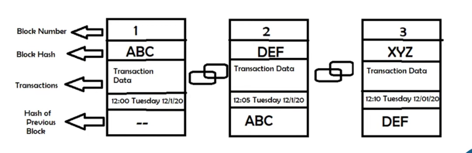
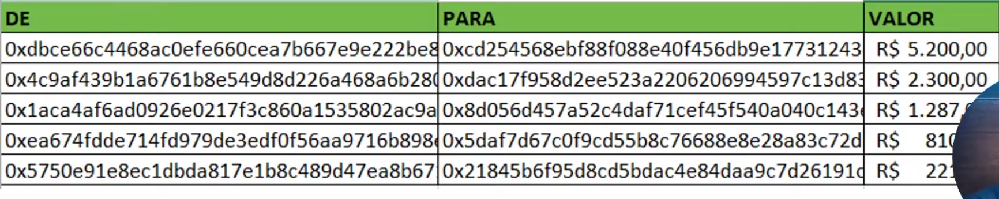

# 💻 PoW - Proof of Work - Prova de trabalho
**A prova de trabalho:**\
🔹É um método para afurmar a validade dois dados.

🔹 Força os mineradores a gastar grandes quantidades de energia e dinehiro na produção de blocos, incentivando-os a permanecer honestos, protegendo assim, a rede.

🔹 É uma das únicas maneiras pelas quais uma rede descentralizadas pde concordar com uma única fonte de verdade.

##  💻  A PROVA DE TRABALHO QUE RESOLVE O PROBLEMA DOS GENERAIS BIZANTINOS

🔹 O Bitcoin **conseguiu resolver o problema dos generais bizantinos** usando um mecanismo de **prova de trabalho** para estabelecer um conjunto de regras claro e objetivo para o blockchain.

🔹Para adicionar informações, **chamadas de blocos**, ao blockchain, **um membro da rede deve publicar uma nova prova de que investiu um trabalho consederavel na criação do bloco**. Este trabalho impões grandes custos ao criador (Devido o auto custo de placas de vídeo e fazendas de mineração), por tanto, os incentiva a publicação das informações honestas.

🔹 O conjuntio de regfras que governa quais transações ***são válidas e quais são válidas também é objetivo**, assim como o sistema para determinar quem pode gerar novos bitcoins.

🔹 Além disso, **uma vez que um bloco foi adcionado** ao blockchain, é **extremamente difícil ou impossivel** remove-lo, torno o passado do Bitcoin imutavel.

## 🧱  GERAÇÃO DOS BLOCOS
  

Se algum membro da rede tentar transmitir informações falsas, todos nós da rede irão imeduatamente recion hece-las como inválidas e ignora-las.

  Como cada nó pode verificar todas as informações na própria rede Bitcoins, não há necessidade de confiar em outros membros da rede, tornando o bitcoins um sistema de confiança

## 📝 REGISTRANDO INFORMAÇÕES NA BLOCKCHAIN

###  💠 1. O REGISTRO DA TRANSAÇÃO
 - De forma simplificada vamos pensar no blockchain como uma planilha de excel, entretanto, a blockchain é descentralizada e distribuída. Sendo assim, qualquer pessoa pode ter uma cópia dessa planilha em seu computador.

   

### 💠 2.  SIGILO E PRIVACIDADE
 - Através de criptografia, ninguém sabe quem são as pessoas envolvidas na transação.

 - Cada endereço (addrress) na blockchain é criptografado à partir de uma chave privada em sua posse. Você precisa gerar uma chave pública para a pessoa que vai te enviar a quantia. Sendo assim, nosso exemplo de planilha, fica assim:

    

###  💠 3.  EXECUTANDO A TRANSAÇÃO

- Quando A faz unma transação e envia cripto pára B, essa transação não é automaticamente incluṕida no blocochain. Ela precisa ser validada. Por isso, ela fica em uma especie de area temporaria, esperando ser incluída no blockchain.

  Observe o status: "pendente" de uma transação.  
  

###  💠 4.  ANALISANDO A TRANSAÇÃO
 - **A cada 10 minutos** (Depende da blockchain) todas as transaçõess do mundo que estãoao na área temporária **são analisadas por uma pessoa, chamada de miner, ou seja, um minerador**
  
- Essa "pessoa", é um **computador ligado à rede do clockchain** que, após **ganhar uma competição matemática (algoritimos de criptografia**), ganha o direito de incluir as transações pendentes no blockchain. Para isso, ele ganha um prêmio, em Bitcoins.

- Quando A fez a transação para B, ele assinou digitalmente as informações dessa transação com sua chave privada. Esse processo de assinatura é como uma operação criptografica em cima de todas as informações da transação e , igualmente, gera uma chave representada por um novo conjuntio de caracters e números (asinatura).
  
  

###  💠 5. TRANSAÇÃO EXECUTADA

- O minerador vai confirmar que essa assinatura é válida e nesse momento é oficializada a data da transação, através de um carimbo oficial de tempo.
  
- Por fim, o prórpio minerador assina a transação e gera novos procedimentos criptográficos, dando orientem a cada transação, ao **TRANSACTION ID**, a chave que oficializa a transacão.
  
  

###  💠 CONCLUSÃO

- Um dura crítica e importante à prova de trabalho é a quantidade de energia necessária para manter a rede segura e descentralizada.

### 🔹**Quanta energia a mineração consome?**
  - O indice de consumo estimou a uma transação de bit, leva 1.449kWh para ser ocnlcuída, ou sejha, aproxidamadamente 50 dias para energia para uma familia media dos EUA.
  

