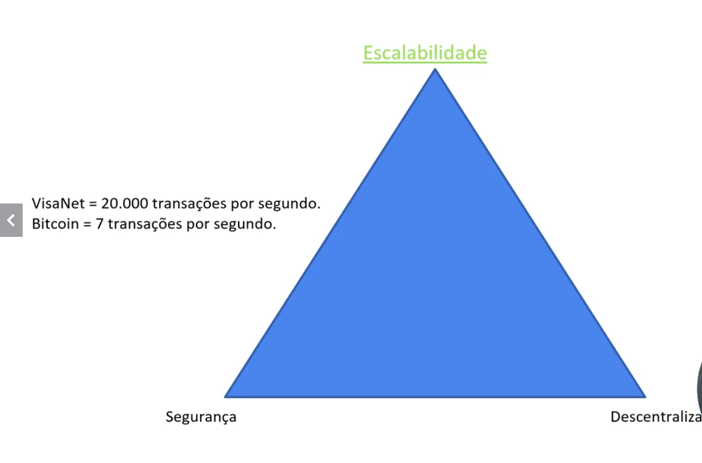
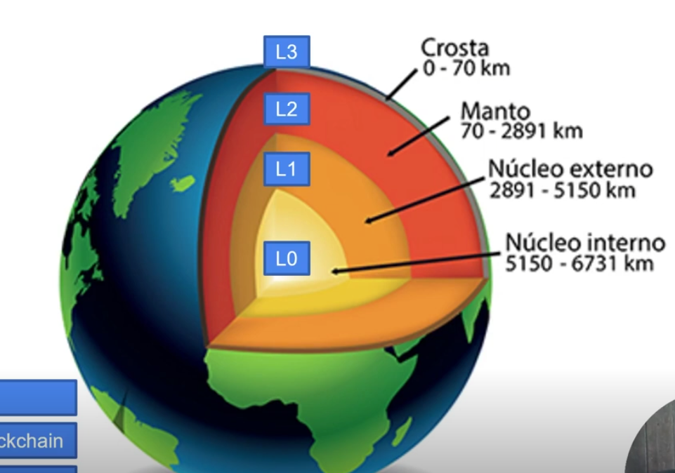
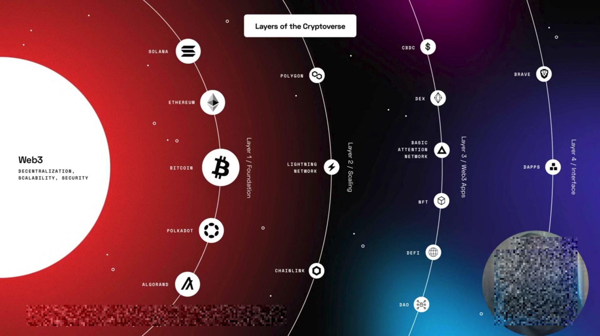

# 💠  LAYERS
  As Layers (camadas) estão surgindo para contornar o grande trilemas das blockchains.
  

## 💠 O QUE SÃO LAYERS?
  L0 - Network\
  L1 - Plataforma Blockchain\
  L2 - Protocolos\
  L3 - Aplicações

  Abaixo imagem meramente ilustrativa

  

  
