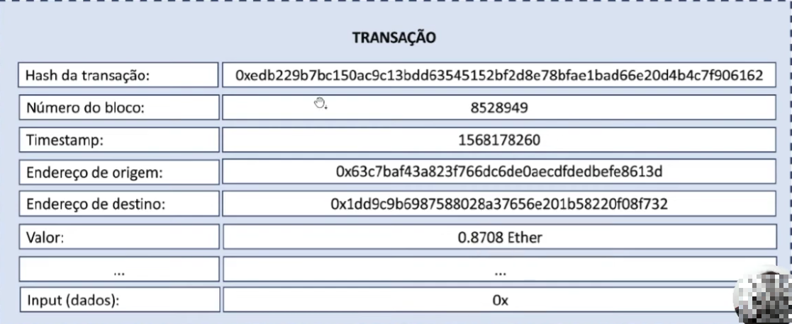
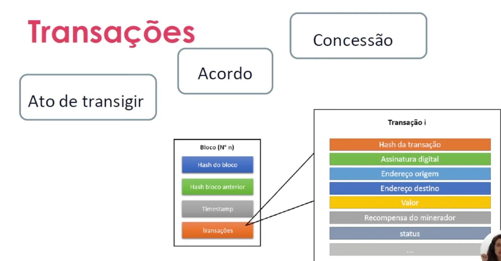
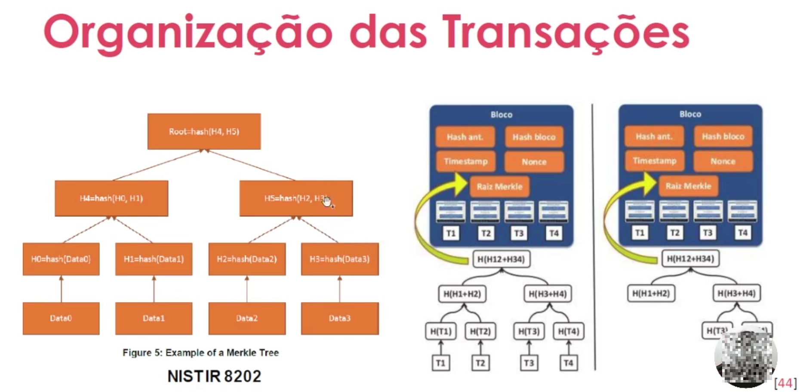
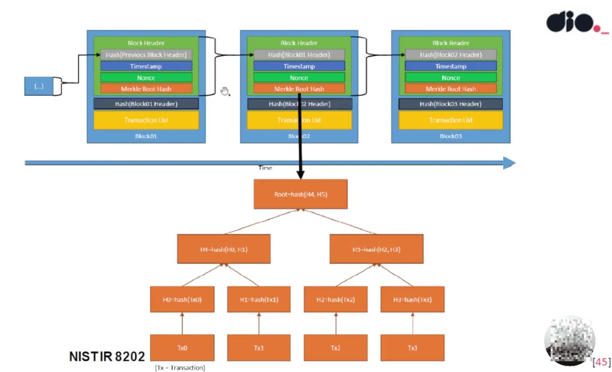

## ✳️ ETAPA 03 - TRANSAÇÕES E BLOCOS

  ## ✳️ ORGANIZAÇÃO DA CHAIN
 - Como os eventos são registrados?
    - Atraves de blocos encadeados
  
 - Qual a estrutura?  
 - Como garantir sua autenticidade e confiabilidade?

  
  
  

  
  

  