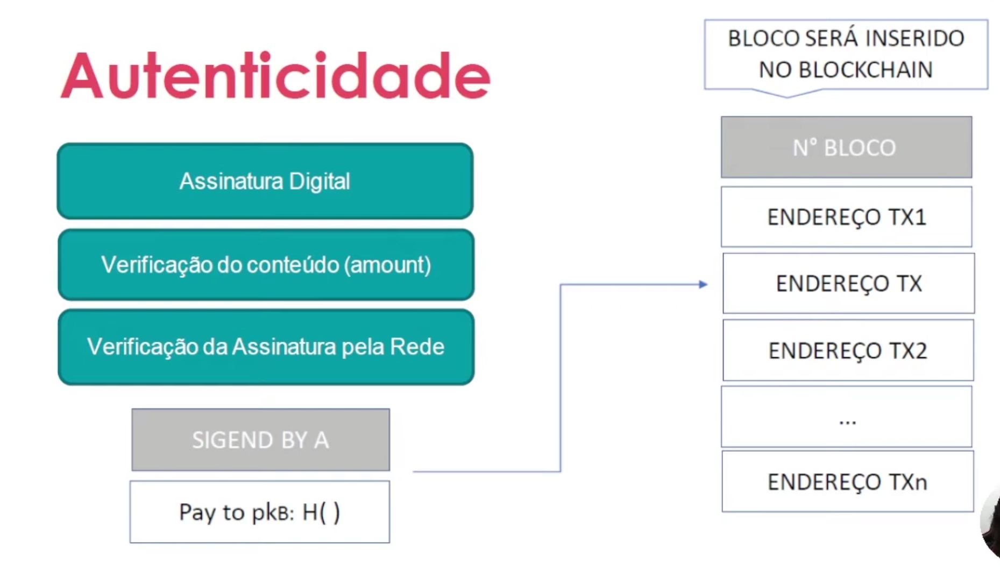
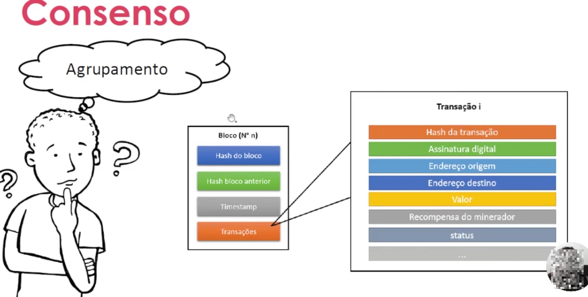

## ✳️ ETAPA 04 - COMO GARANTIR A ORIGEM DOS EVENTOS
  - É possível roubar?
  - DoS - Bloquendo a Transação?
  - Como garantir  o remetende?
  - Um usuário pode causa o mesmo amout em transações distintas?
  - Qual a garantia de inserção da minha transação em um bloco?
  - Como garantir que o bloco não se altere?
  - Por que não posso modificar a Blockchain?

## AUTENTICIDADE
   - **Sigend by:** assinatura digital

   - **Pkb:** chave publica de B

   - **H():** hash da treansacao
  
    A ==> B

  
  
  
  
  
## Centário de falha na autenticacao
  - Falha na autenticação:a transação se torna invalida.
  - Double spendig (Resolvido pelo BTC - o gastar o mesmo valor duas vezes)
  
## Validação de blocos
  - Nós mineradores
  - Criptografia por Hash 256 bits
  - Desafio criptografico
  - Mecanismo de consenso: Define que o bloco está validado e manda para toda a rede
  - Incentivos

  
