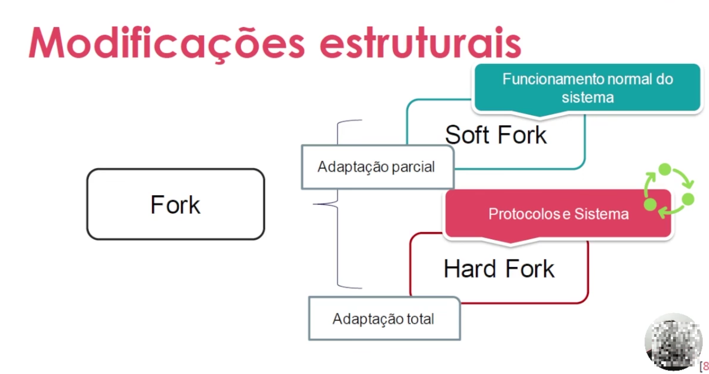

## ✳️ ETAPA 05 - INSERÇÃO DE BLOCOS E BIFURCAÇÕES
  ### Bifurcação
  - As transações podem não ser concluídas em um bloco?
  - Mais de um bloco pode ser validado com o mesmo tumestamp?
  - Como resolver?

  ### Modificaões estruturais
  - Atualizações de software e plataformas
  - Como ocorre na blockchain?
  - Conseso
  - Atualizaões de sistema
  
  ### Fork, Soft Fork e Hard Fork
  - **Soft Fork:** Modificações que não interferem na usabilidade do dia-a-dia.
  
  - **Hard Soft:** Modificação que demanda aceite de todos os envolvidos da rede.
  
