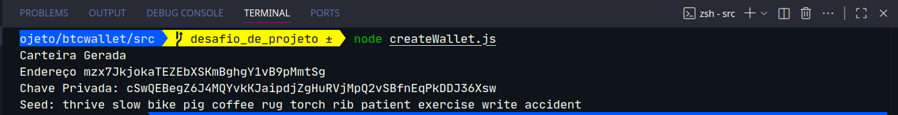
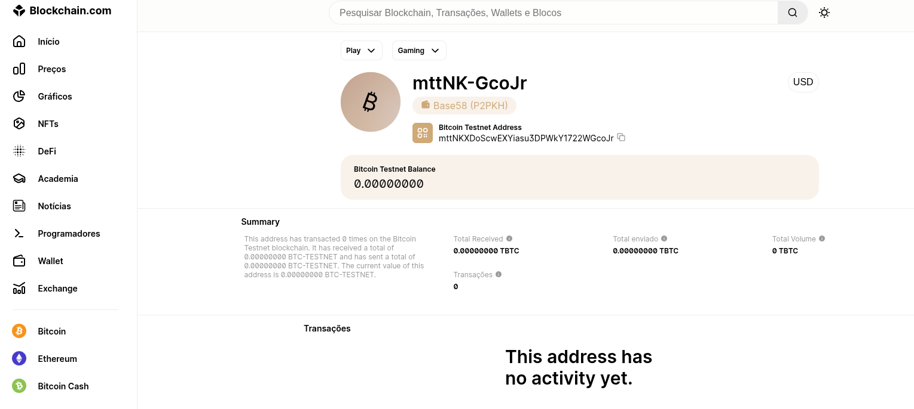

# ✳️ CRIANDO E UTILIZANDO SUA CARTEIRA DE CRIPTOMOEDAS

## ITRODUÇÃO
  ### ✳️ NESTE DESAFIO DE PROJETO, VAMOS:
  - Construir um gerador de carteiras BTC;
  - Importar para um software gerenciador de carteiras; (PrimaryKey e PrivateKey)
  - Realizar transações de envio e recebimento de BTC.

## ✳️ TECNOLOGIAS UTILIZADAS
  - Javascript
  - Electrum Bitcoin Wallet
  - Bitcoin Faucet Generator (Cripto fake para teste)

## ✳️ ETAPAS DO DESAFIIO
  - Desenvolver um gerador de carteiras
  - Importar uma carteira gerada no Electrum
  - Receber e enviar transações

## ✳️ ESTRUTURA DO DESAFIO
  - Node Js
  - Electrum

## ✳️ PASSO A PASSO:
  ## Iniciando server node
`npm init -y`

  ## Instalando libs necessárias
  `npm install bip39 bip32@2.0.6 bitcoinjs-lib --save`

  ### Utilizaremos uma carteira determinisca
  ```
    // Aderivacao de carteiras HD
    const path = `m/49'/1'/0'`
  ```

 ### Gerando o mnemonico: conjunto de palavras aleatorias que formam a seed
  - Gerando a raiz da carteira determinisca
```
  let mnemonic = bip39.generateMnemonic()
  const seed = bit39.mnemonicToSeeSync(mnemonic)

  let root = bip32.fromSeed(seed, network)
```

## Code Review
```
//import dependeces
const bip32 = require('bip32')
const bip39 = require('bip39')
const bitcoin = require('bitcoinjs-lib')

//definir a rede: bitcoin:rede principal (0)| testenet (1): rede teste
const network = bitcoin.networks.testnet

const path = `m/49'/1'/0'`

let mnemonic = bip39.generateMnemonic()
const seed = bip39.mnemonicToSeedSync(mnemonic)

// criando a raiz da carteira HD
let root = bip32.fromSeed(seed, network)

// criando uma conta - par pvt-pubkey
let account = root.derivePath(path)
let node = account.derive(0).derive(0) //gera o nó

let btcAddress = bitcoin.payments.p2pkh({
  pubkey: node.publicKey,
  network: network,

}).address

console.log("Carteira Gerada");
console.log("Endereço", btcAddress);
console.log("Chave Privada:", node.toWIF());//formata chave 
console.log("Seed:", mnemonic);
```
## ao executar o teste


## ✳️ IMPORTAR CHAVE PRIVADA PARA DENTRO DE UM SOFTWARE GERADOR DE CARTEIRA - ELECTRUM PARA FINALIZAR A TRANSACAO
  - Site: https://electrum.org
  
## ✳️ Realizando a instalaçao do flatpack no archlinx
  - Você pode considerar instalar direto pelo AUR, mas realizaremos instalando e habilitando os flatpack direto no flathub
  - Site: https://flathub.org/en/apps/org.electrum.electrum
  - Manual Install Make sure you follow the setup guide for your Linux distribution before installing
    
      ```

        flatpak install flathub org.electrum.electrum

        //run
        flatpak run org.electrum.electrum

      ```

## APÓS INSTALAÇÃO DO ELECTUM - config
 Keywords:
 ```
easily enhance tiny broccoli will web planet fence trip special kite wrist
 ```
### IMPORTAR CARTEIRA GERADA

- No site BTC, no TESTENET
  https://www.blockchain.com/pt/explorer/addresses/btc-testnet/mttNKXDoScwEXYiasu3DPWkY1722WGcoJr

  

## ACESSANDO O BITCOIN FALCET
- Cripto que nao tem nenhum valor
- BitcoinTestNet Facucet:[//freebitco.in/site/bitcoin-faucet](https://bitcoinfaucet.uo1.net/)

