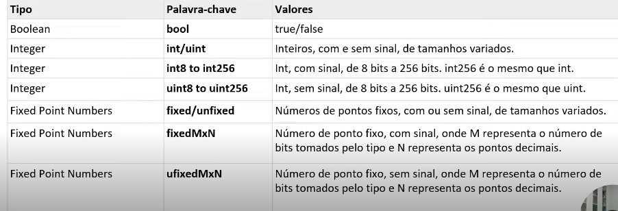

# 💠 TIPOS DE DASDOS
  Todas as linguagens de programaçao possuem algum tipo de tipagem dos seus dados.
  
 

 Um outro tipo de dado, particular do solidity é o **address**.\
 Uma variavel do tipo **address** armazena um valor de 20 bytes representando um endere;o Ethereum.
 Exemplo:
 `addres` `X` `=` `0x212` 

 ## 💠 VÁRIAVEIS
  🔹 Variaveis de Estado

  🔹 Variaveis Locais

  🔹 Variaveis Globais
  ---

  🔹 O solidity é uma linguagem de **tipagem estática**, ou seja, o tipo de variável de **estado** ou **local** deve ser **especificado** durante a declaração.

  🔹 Cada variável declada sempre tem um valor padrão baseado em seu tipo.

  🔹Não há conceito de "indefinido" `undefined` ou nulo `null`
  

 ## 💠 VÁRIAVEIS  DE ESTADO
  São variaveis cujo valores são armazenados permanentemente em um armazenamento (storage) de um contrato.

  ### Váriavel de Estado
```
  pragma solidity ^0.5.0;
  contract SolidityTest {
    unit storedData; 
    constructor() public{
      storedData = 10
    }

    function getResult() public view return(unit){
      unit a = 01;

      return stotrdData;
    }
  }
```
 ### 💠  Onde:

  ### Declarando uma variavel de estado 

  `unit storedData; `

  ### Utilizando uma varivel de estado

  `storedData = 10 `

  ### Acessando uma variavel

  `return stotrdData; `


 ## 💠 VÁRIAVEIS  LOCAIS
  Variáveis cujos valores estão disponíveis apenas dentro de uma função onde ela está definida.

  Os parametros da funcao sao sempre locais para essa função

  Essas varias são especiais que existem na workspace global e fornecem informações sobre o blockchain e as propriedades de uma transação.


## 💠VARIÁVEIS GLOBAIS EM SOLIDITY SÃO ESPECIAIS
  🔹 Normalmente em outras linguagens, a teoria do "escopo global" nada mais é que uma varivel acessivel a todo ambiente 

  🔹Como  workspace ; escopo. Por fim, em solidity, este conceito muda um pouco devido existir algumas variaveis ja nomeadas ou atributos da linguagem utilizadas para definir a estrura de bloco. 

  🔹 Vejamos abaixo os exemplos mais utilizados

  Nome
```js
  blockhash(unit blockNumber) returns (bytes32)
  block.coinbase(address payable)
  block.difficulty(unit)
  block.gaslimit(unit)
  block.number(unit)
  block.timestamp(unit)
  gasleft() returns (unit256)
  msg.data(bytes calldata)
  msg.sender(address payble)
  mesg.sig(bytes4)
  msg.value(unit)
  now(unit)
  tx.origin(adrress payble)
```
 ### 💠 Retornos
 
 `blockhash(unit blockNumber) returns (bytes32)` 🔹 Hash de um determinado bloco

 `block.coinbase(address payable)` 🔹Bloco do atual "minerador" do bloco

 `block.difficulty(unit)` 🔹 Dificuldade de mineração do bloco atual

 `block.gaslimit(unit)`🔹Limite do Gas (taxa de transação) do bloco atual

 `block.number(unit)`🔹 Número do bloco atual

 `block.timestamp(unit)`🔹Carimbo do tempo do bloco

 `gasleft() returns (unit256)`🔹 Gas restante

 `msg.data(bytes calldata)`🔹Dados

 `msg.sender(address payble)`🔹 Remetente da transação

 ` mesg.sig(bytes4)`🔹Identificador da função

 ` msg.value(unit)`🔹 Valor da transação (Wei)

 ` now(unit)`🔹Custo da transação

 ` tx.origin(adrress payble)`🔹Endereço de origem da transação

 ### 💠 Nomeclatura de variáveis
  - Variáveis **NÃO** devem usar palavras reservadas da linguagem.
  - As variáveis **NÃO** podem ser **INICIADAS** com **NÚMEROS (0-9)**
  - O Solidity é case-sensitive
- 
 ### 💠 ESCOPOS DE VARIAVEIS
 🔹 **PUBLIC:** As variáveis de estado públicas podem ser acessadas internamente, bem como por meio de mensagens.

  Para uma variável de estado pública, uma função **getter** é automaticamente gerada.

  🔹**INTERNAL:** As variáveis de estado **internal** podem ser acessadas apenas internamente a partir do contrato atual onde são definidas, e não acessíveis no contrato derivado dele.

  ### 💠 CONCLUSÃO
    Neste material abordamos conceitos relativos à manipulação e declaração de variaveis no Solidity


  
