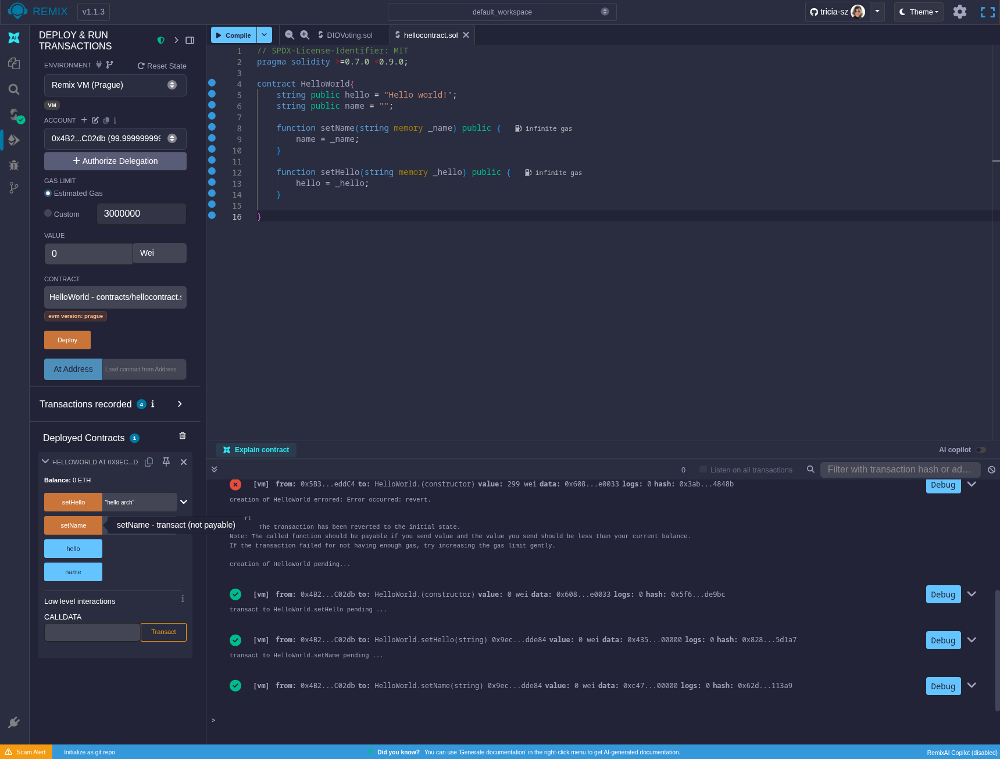
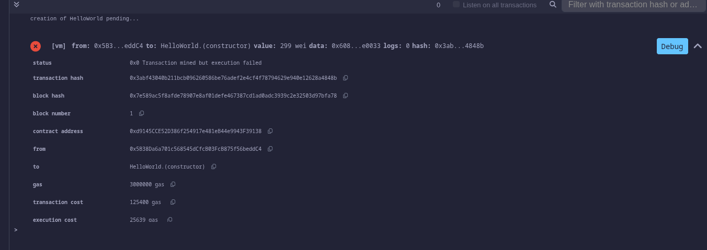
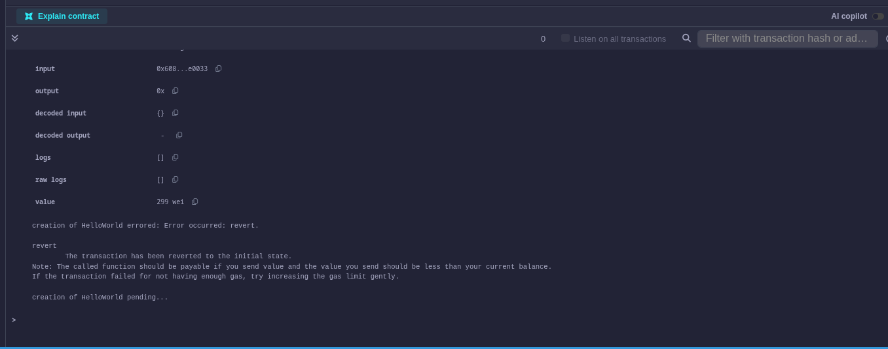
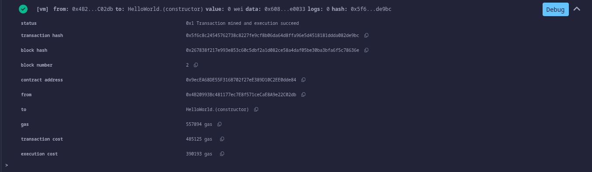

# WEB3 js
### code

 erro 1 
 

 ### logo do erro

 

### "Deduzi" que pelo balance, ja havia gastado o gas em testes anteriores, quando visualizei a quantidade de gas que precisaria e a quantidade que eu tinha nao corresponderia, alterei o endereco de carteira e o codigo rodou normalmente. Mesmo com meu inglês meia boca que me ajudou a entender o erro sem apelar para o gpt logo de cara, sem antes formar base sólida própria.Abaixo contrato rodando normalmente.

 

 ```js
 // SPDX-License-Identifier: MIT
pragma solidity >=0.7.0 <0.9.0;

contract HelloWorld{
    string public hello = "Hello world!";
    string public name = "";

    function setName(string memory _name) public {
        name = _name;
    }

    function setHello(string memory _hello) public {
        hello = _hello;
    }

}
 
 ```


