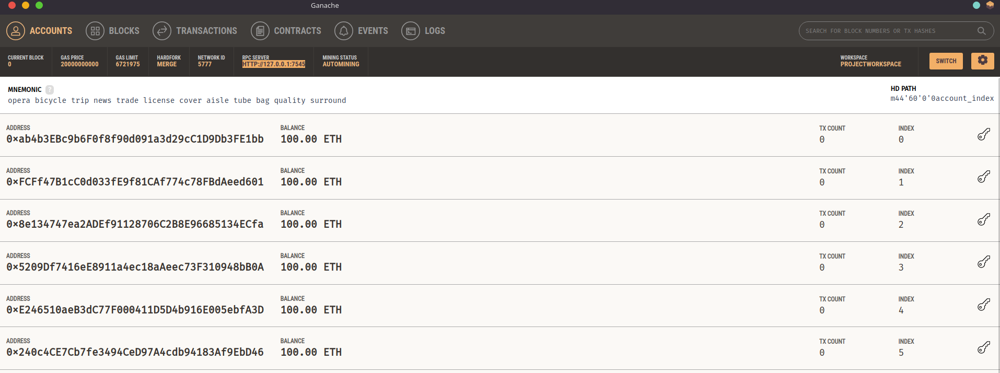
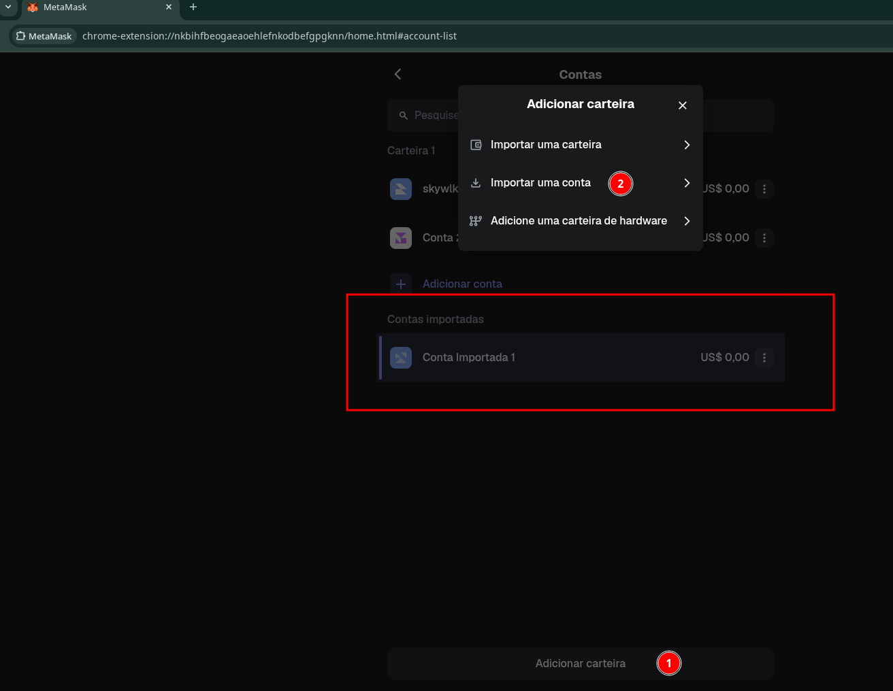
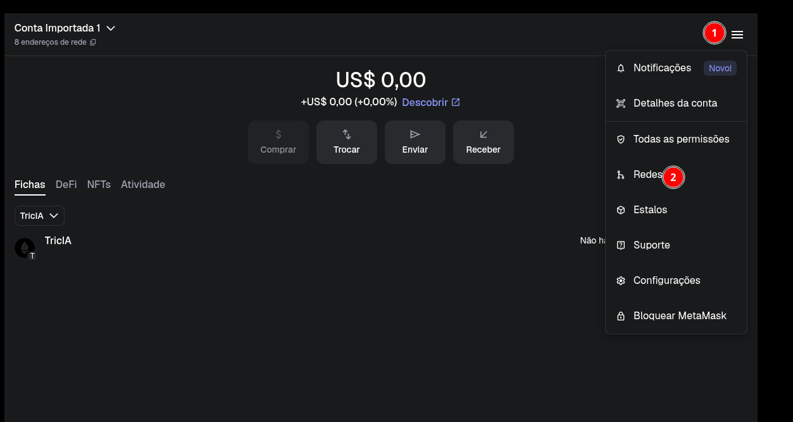
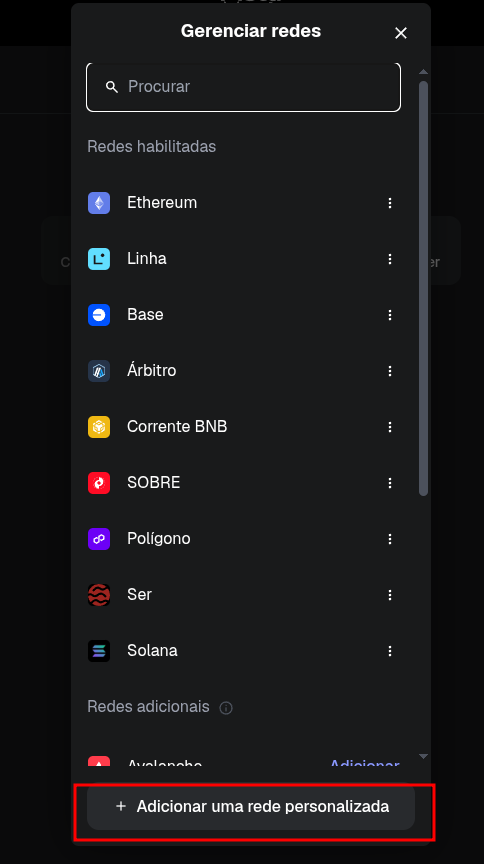
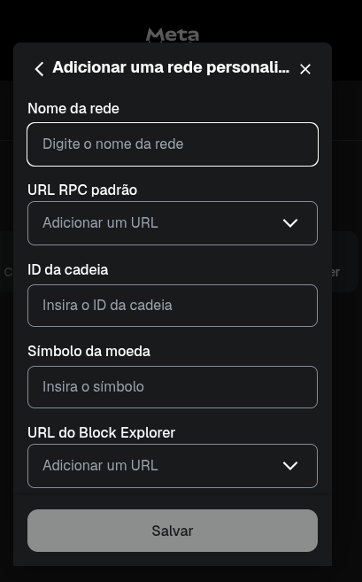

# 💠 CONECTANDO UM SERVIDOR NA BLOCKCHAIN

### 💠 Criar uma conta no metaMask (nao esqueça de armazenar as chaves em um local seguro)

### 💠 Baixar o ganash para emular a block.
 - No windows é só baixar, next, next;
 - No mac, deve ser também só  next next.
 - No linux, vai depender da distro que você está utilizando. Base Debian, pode ter na loja ou só baixar o .deb direto n o link oficial: https://archive.trufflesuite.com/ganache/
- No caso, como utlizo o Arch, foi ainda mais fácil. Não tinha na lib oficial do pacman, optei pelo gerenciador do YAY, conforme doc do ArchLinux.
`yay -S ganache-bin`

### CRIAR WORKSPACE DO GANESH


 - Copie a chave privada e faça a importação de conta direto no Metamask
  
  

## CRIAR A REDE (TOKEN)




# 💠 Dê um nome a rede, ao simbolodo da rede e no IP, cole a chave local do ganash.
Corrigindo, no RPC SERVER, cole o endereço do ganash
HTTP://127.0.0.1:7545

Simulação de criação de rede:

```js

  Nome da rede (token):
  TricIA

  URL RPC padrao: (RTC do ganash local)
  HTTP://127.0.0.1:7545

  ID da cadeira:
  1337
  
  Simbolo da moeda:
  TricIA
```

[salvar]


## Após isso, só realizar conexão com a IDE Remix