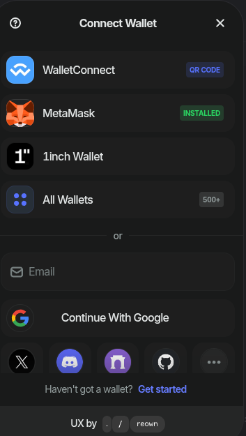
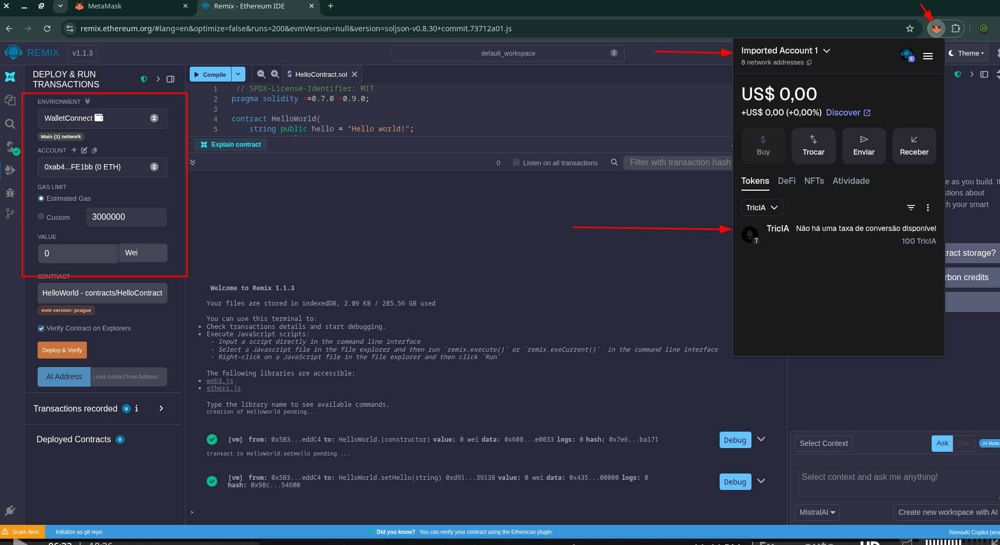

# 💠 CONECTANDO O AMBIENTE GANASH COM IDE REMIX VINCULADA AO METAMASK
 - No perfil / carteira metamask, valide a conta configurada com token está ativa.

  - No ganash, valide se o address bate
  - No remix, na opção de ambientes ENVIRIOMENTS, selecione `Injected Provider Metamask` as aulas do bootcamp foram gravadas eem 2022, levando em consideração que houveram atualizações, algumas confis podem ter mudado.
  
  Ao invés de encontrar `Injected Provider Metamask`

  

  
 

 ### Pronto, carteira conectada!
 