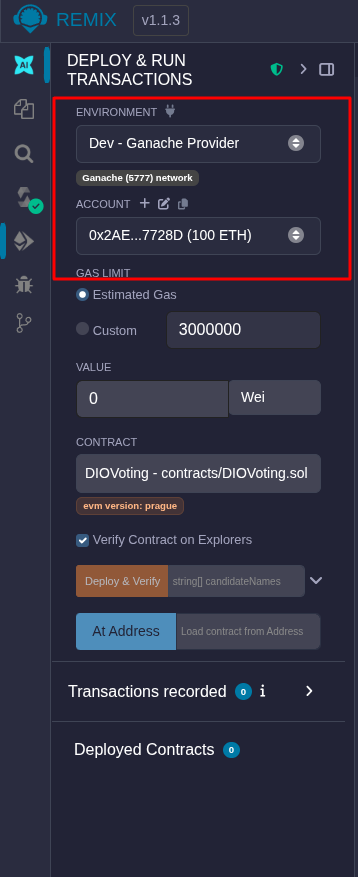
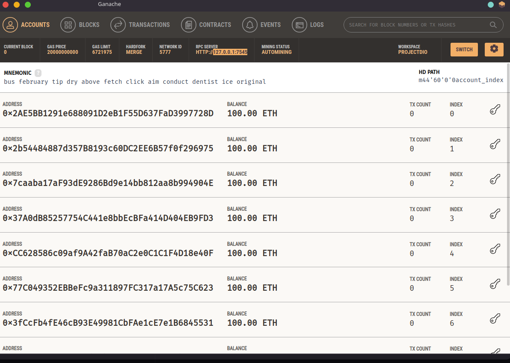
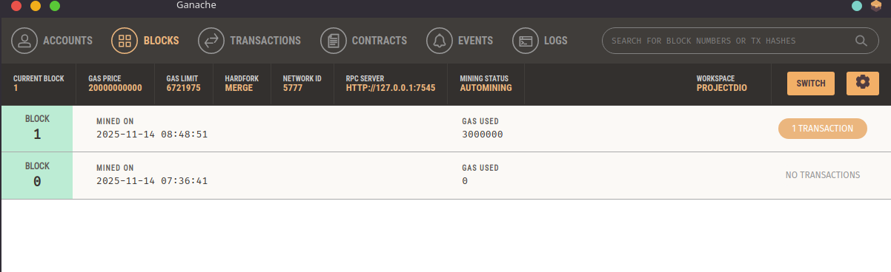
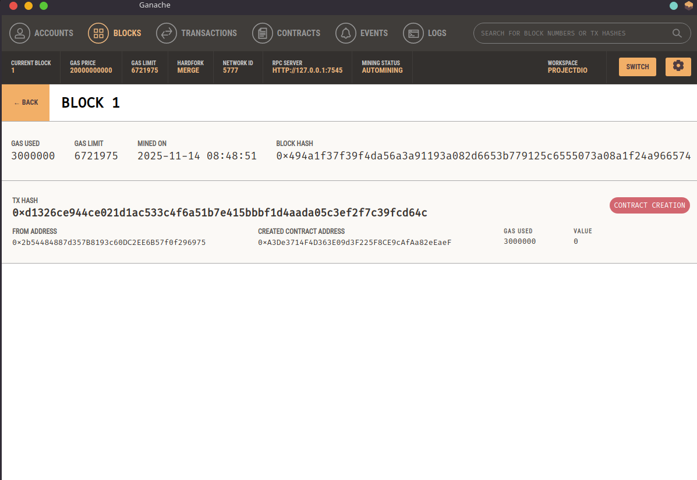

# 💠 CRIANDO TOKEN ERC-20

Vamos implementar as funões e definir os campos e informacoes que caracaterizam um token ERC-20.

Vamos itilizar a IDE Remix para desenvolvimento local.

## 💠 TestNets

Um TestNet é uma rede de testes simulando uma rede real, possuindo nós, com custos de transações e latÊncias similares a uma rede real.

A rede Ethereum possui algumas TestsNets disponibilizadas no Metamask.

## 💠 CONECTAR O GANASH NO REMIX

Na confiuguração anterior, realizamos as configurações (atualizadas) do ganash com MetaMask e Remix.
  - 
  - 

Iniciando novo projeto, a opcao InjectWeb3 não está mais disponivel, neste vcaso, o que fiz foi em ENVIROMENT optar por "Dev-Ganash Provider" e inserir diretamente o RCP SERVER: `127.0.0.1:7545`

Pode ser que venha dar errado, pois o mesmo RCP estava setado no metamask ao criar um ambiente de rede local na carteira. Melhor testar.

```js
 // SPDX-License-Identifier: MIT
 pragma solidity ^0.8.0;

 //cabecalhos das funcs Getters: Nao alteram variavel, apenas leem e retornam
 interface IERC20{
   //func de consulta que retorna numero inteiro que se refere a quantidade total de tokens do contrato
   function totalSupply() external view returns(uint256);
   //saldo de determinado endereco
   function balanceOf(address account) external view  returns(uint256);
   //permitir que o endereco possa gastar os tokens de outro endereco
   function allowance(address owner, address spender) external  view returns (uint256);

   //Functions
   function transfer(address recipient, uint256 amount) external returns(bool);
   //verifica se a treansfer foi aprovada ou naoo
   function approve(address spender, uint256 amount) external returns (bool);
   function transferFrom(address sender, address recipient, uint256 amount) external returns(bool);

   event Transfer(address indexed from, address indexed to, uint256 value);
   event Approval(address indexed owner, address indexed spender, uint256);

 }


 contract TRICIAToken is IERC20{
   string public constant name = "TRICIA Token";
   string public  constant symbol ="TRICIA";
   uint8 public constant decimals = 18;

   mapping (address => uint256) balances;

   mapping(address => mapping(address => uint256)) allowed;

   uint256 totalSupply_ = 10 ether;

   constructor(){
       balances[msg.sender] = totalSupply_;
   }

   //implementar as funcs da interface (sobreescrever interface)
   function totalSupply() public override  view returns(uint256) {
       return totalSupply_;
   }

   function balanceOf(address tokenOwner) public override view returns(uint256){
       return balances[tokenOwner];
   }

   function transfer(address receiver, uint256 numTokens) public override returns (bool){
       require(numTokens <= balances[msg.sender]);
       balances[msg.sender] = balances[msg.sender]-numTokens;
       balances[receiver] = balances[receiver]+numTokens;
       emit Transfer(msg.sender, receiver, numTokens);
       return true;
   }

   function approve(address delegate, uint256 numTokens) public override returns (bool){
       allowed[msg.sender][delegate] = numTokens;
       emit Approval(msg.sender, delegate, numTokens);
       return true;
   }

   function allowance(address owner, address delegate) public override view returns(uint){
       return allowed[owner][delegate];
   }

   function transferFrom(address owner, address buyer, uint256 numTokens) public override returns (bool){
     require(numTokens <= balances[owner]);
     require(numTokens <= allowed[owner][msg.sender]);

     balances[owner] = balances[owner]-numTokens;
     allowed[owner][msg.sender] = allowed[owner][msg.sender]-numTokens;
     balances[buyer] = balances[buyer]+numTokens;
     emit Transfer(owner, buyer, numTokens);
     return true;
   }
 }
```

  
  
