#  💠 Desafio - CRIANDO SUA PRIMEIRA MOEDA NA REDE ETHEREUM
### 💠 Introdução
  Neste desafio de projeto vamos criar um token no padão ERC-20 na rede Ethereum, além de realizar transações.

### 💠 Tecnologias utilizadas
  - Silidity
  - Truffle
  - Ganash
  - Remix IDE
  - Metamask
##  💠 Etapas do desafio
   - Implementação do token ERC-20
   - Publicação na Blockchain
   - Receber e enviar transações


##  💠 Criada rede dentro do Metamask (conexão com server ganash emulator blockchain)

##  💠 1 - Inciar o Ganash
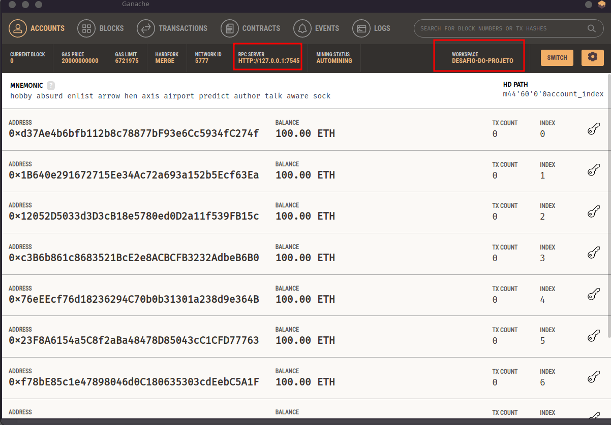

## 💠  2 - Conectar o RCP SERVER no Metamask (Criar a rede)

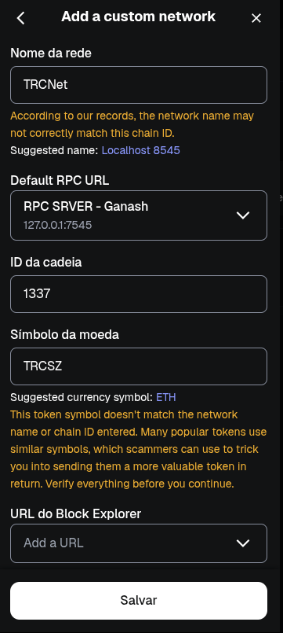

##   💠 Ao salvar configs da network local
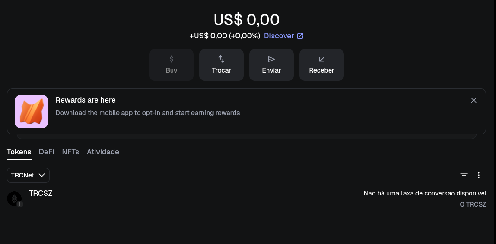

#  💠 Conectando conta Metamask com Remix

##  💠 Importar uma conta dentro do Metamask: basicamente transferir chave privada (mnemonic) do ganash e vincular ao metamask para ter gas para usar no remix quando importada.

###  💠 1- Importar conta no Metamask
 ### Acesse seu perfil e vá na opção "Add Wallet" (Addcionar a Carteira)

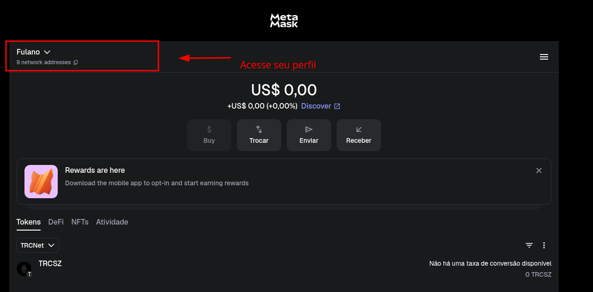

####  💠 Add Wallet

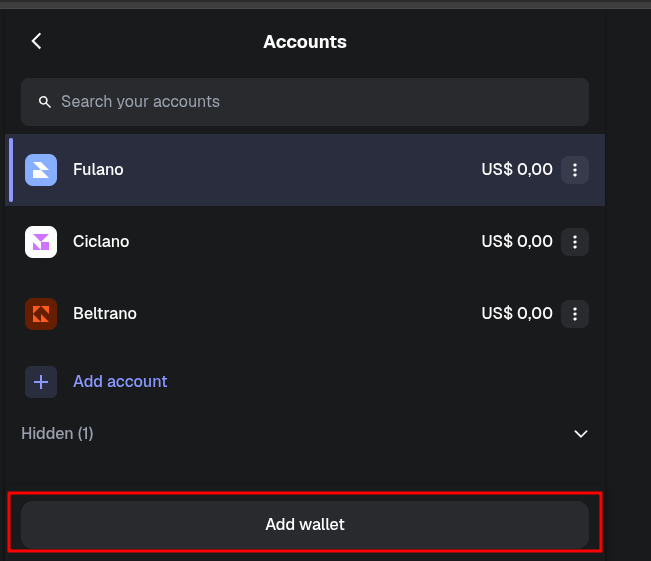

####  💠 Import Account
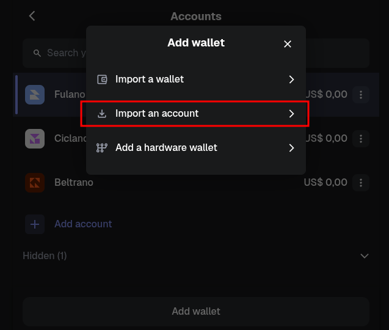

####  💠 Form import chave privada 


###  💠 Ganash import PV
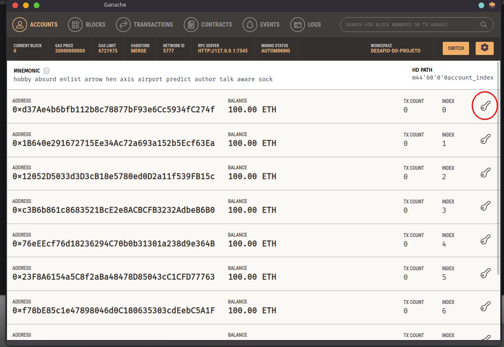

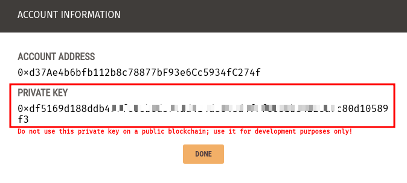

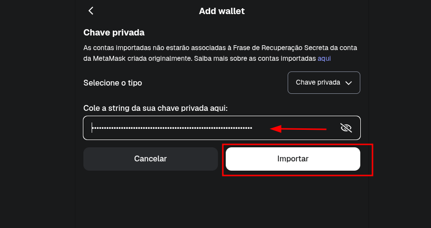
###  💠 Na imagem abaixo, mostra a conta importada
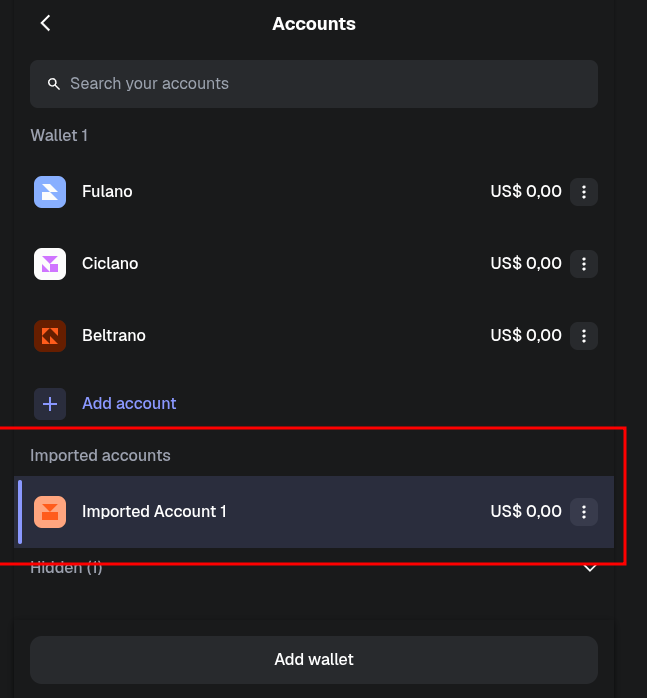
##  💠 Dê um nome a conta importada
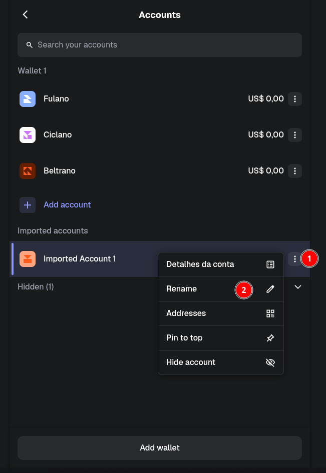
##  💠Renomeado TRICIAcc01
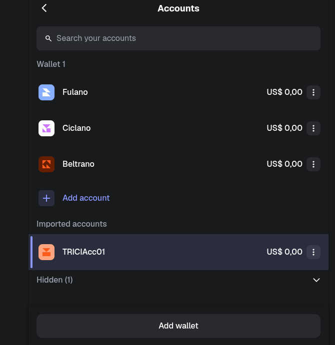

##  💠  Perceba que a conta nainda não está conectada (Ao Remix IDE)
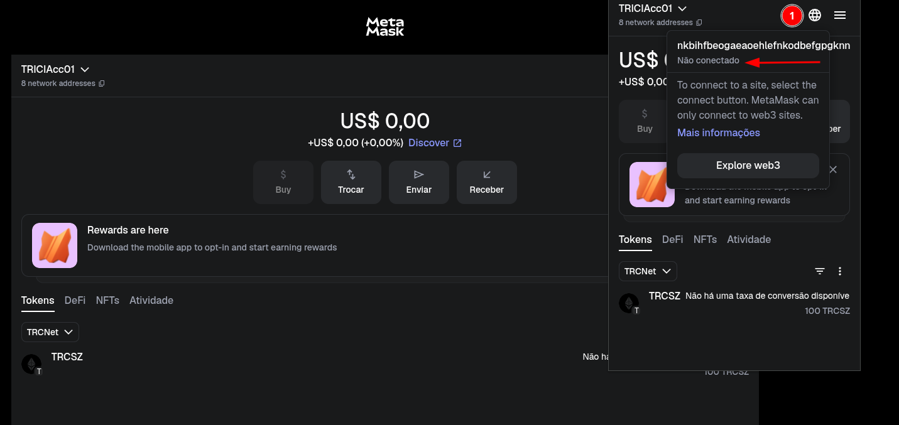


## REALIZANDO A CONEXÃO COM O REMIX, MANUALMENTE

###  💠 Acesse a IDE e na sessão de copiladores, acesse "ENVIROMENT" > "Injected Provider - Metamask". 
### OBS: A plataforma foi atualizada, agora você consegue realizar essa conexão pelo menu "Browser Extension" > "Injected Provider" > "Metamask"
  
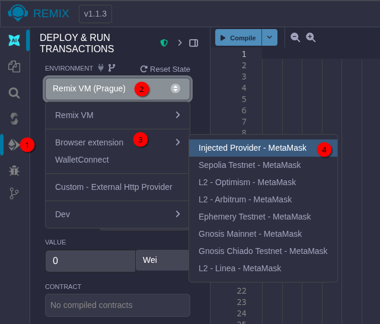

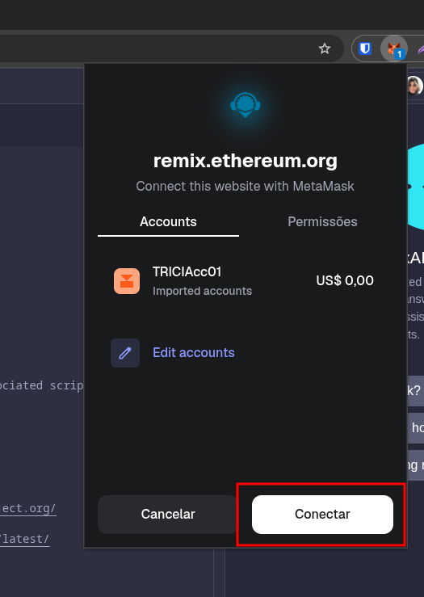

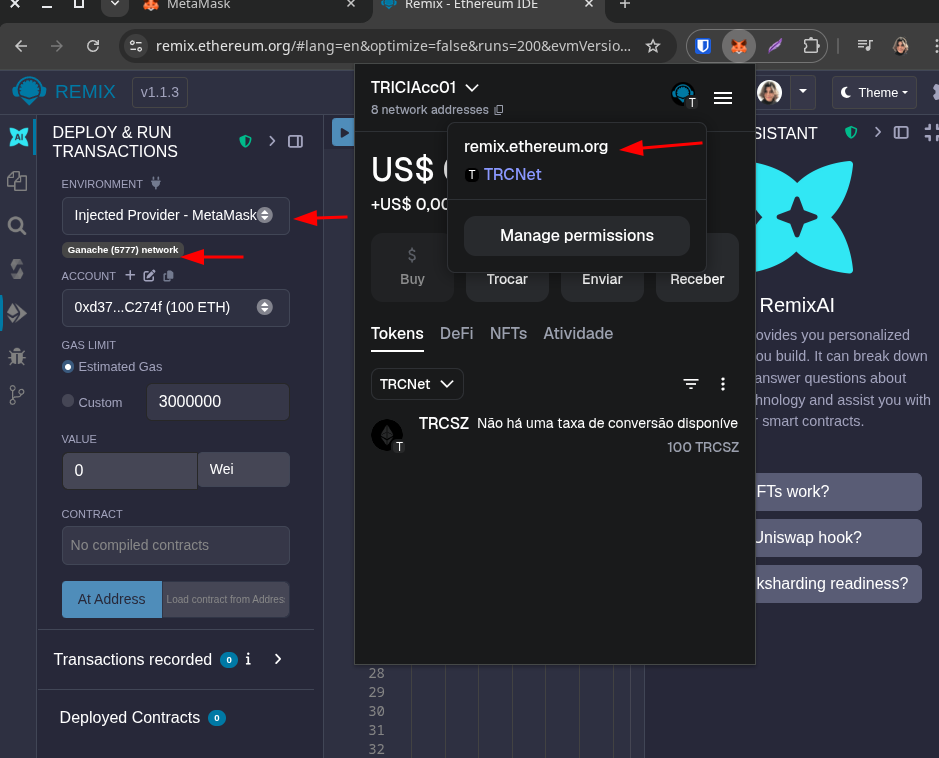

##  💠 Validando conexão: VErificar se inicio e fim da chave publica foi importada:

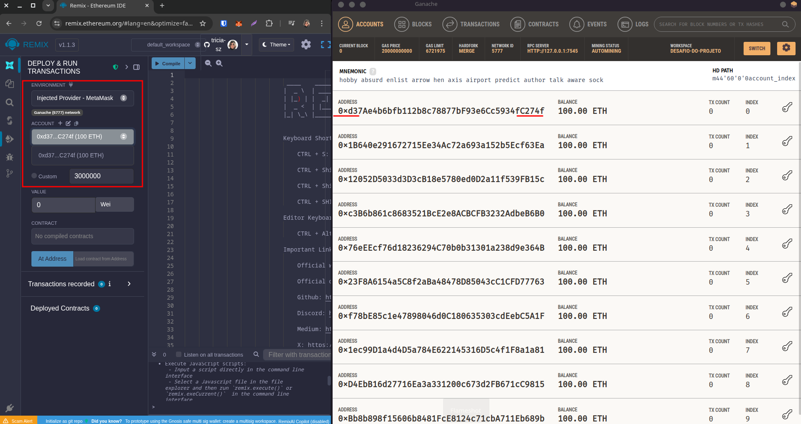


##  💠 COM O AMBIENTE CONFIGURADO E CONECTADO, AGORA VAMOS POR A MÃO NA MASSA E CRIAR NOSSA MOEDA.

##  💠 1.0 - Abra a pasta de contrado do Remix e crie um novo arquivo. Dê o nome que achar necessario, neste projeto vamos chamar de TRICIACoin.sol

###  💠 1.1 - Interface da Função que faz LEITURA TOTAL DE TOKENS presentes no contrato.
```js
  interface IERC20{
    function totalSupply() external view returns(uint256);
  }
```

###  💠 1.2 - Interface da Função que CHECA SALDO de determinado endereço
```js
  interface IERC20{
    function   balanceOf(address account) external view returns(uint256);

  }
```

###  💠 1.3 - Interface da Função que CHECA O ALLOWANCE (meio que conta conjunta onde pode-se compartilhar limites e gastos) Neste caso verificamos qual LIMITE DEFINIDO  e qual LIMITE ATUAL
```js
interface IERC20{
    function allowance(address owner, address spender) external view returns(uint256);
}
```

###  💠 1.3 - Interface da Função de TRANSFERENCIA de token
```js
  interface IERC20{
    function transfer(address recipient, uint256 amount) external returns(bool);
  }
```

###  💠 1.3 - Interface da Função APROVAÇÃO de transação
```js
  interface IERC20{
    function approve(address spender, uint256 amount) external returns(bool);
  }
```

###  💠 1.3 - Interface da Função TRANSFER FROM. 
  - Baicamente, temos o ALLOWANCE diz quanto voce pode gastas. O TRANSFER FROM é você gastar esse ALLOWANCE.
  - Exemplo: Uma pessoa que vai enviar e outra pessoa que vai receber. No caso, duas pessoas casadas onde uma usa o limite em nome da outra.
```js
  interface IERC20{
    function approve(address spender, uint256 amount) external returns(bool);
  }
```

### Nossa interface, até então com nossos GETTERS e funções pre determinadas..
```js
// SPDX-License-Identifier: MIT
pragma solidity ^0.8.0;

interface IERC20{

    //Getters
    function totalSupply() external view returns(uint256);
    function balanceOf(address account) external view returns(uint256);
    function allowance(address owner, address spender) external view returns(uint256);

    //Functions
    function transfer(address recipient, uint256 amount) external returns(bool);
    function approve(address spender, uint256 amount) external returns(bool);
    function transferFrom(address sender, address recipient, uint256 amount) external  returns(bool);
}

```

###  💠 1.3 - Também na interface, vamos inserir os Eventos que serão setados no contrato da coin. O EVENT TRANSFER E EVENT APPROVAL (Lembrando que events serão literalmente  notificações acionadas quando uma determinada função é executada)

```js
  interface IERC20{
    //Getters [...]
    //functions [...]
    //Eventos
    event Transfer(address indexed from, address indexed to,uint256 value );
    event Approval(address indexed owner, address indexed spender, uint256);

  }
```


###  💠 1.4 - Finalizada Interface
```js
 // SPDX-License-Identifier: MIT
pragma solidity ^0.8.0;

interface IERC20{

    //Getters - Não alteram dados, apenas os exibem - view
    function totalSupply() external view returns(uint256);
    function balanceOf(address account) external view returns(uint256);
    function allowance(address owner, address spender) external view returns(uint256);

    //Functions
    function transfer(address recipient, uint256 amount) external returns(bool);
    function approve(address spender, uint256 amount) external returns(bool);
    function transferFrom(address sender, address recipient, uint256 amount) external  returns(bool);
    
    //Eventos
    event Transfer(address indexed from, address indexed to,uint256 value );
    event Approval(address indexed owner, address indexed spender, uint256);
}

```

## 2 - IMPLEMENTANDO AS FUNÇÕES LISTADAS NA INTERFACE PARA SEREM EXECUTADAS CONFORME O CONTRATO DA NOSSA MOEDA: TRICIACoin.

## 2.1 - Definindo os atributos / Campos da moeda. Onde:
  - `string public constant name = "TRICIA Coin";` 🔹 Referece ao nome da moeda
  - `   string public constant symbol = "TRICIA";`🔹Simbolo da moeda
  - ` uint8 public constant decimals = 18;`🔹 Quantidade de casas decimais que a moeda terá
```js
  contract TRICIACoin is IERC20{
    string public constant name = "TRICIA Coin";
    string public constant symbol = "TRICIA";
    uint8 public constant decimals = 18;
}
```
## 2.2 - Realizando o mapping que tem endereço que aponta para um balance. Basicamente mostrar o saldo do endereço.
```js
    mapping (address => uint256) balances;

```
## 💠 2.2 - Abaixo, trata-se de uma verificação em um ENDEREÇO, onde dentro deste endereço, possui OUTRO MAPPING para buscar um denreço e um valor. Por exemplo, conta conjunta. Quantas contas forem permitidas gastar e qual valor gasto por eles.

### 💠 Podemos ter como exemplo, um voucher de compra compartilhada(Me veio á mente, um voucher de cinema dado por uma empresa para um grupo de 3 pessoas que venceu um desafio). Este voucher(conta) com 3 endereços atrelados para 3 pessoas diferentes usarem de acordo com limites definidos.


```js
  mapping(address => mapping(address => uint256)) allowed;
```

## 2.3 - Setando o suplicamento total de 10ETH
```js
  uint256 totalSupply_ = 10 ether;
```

## 2.4 - Criando o metodo cosntrutor para atribuir valores ao dono do contrato [sender] - endereço que publicou o contrato na blockchain
```js
   balances[msg.sender] = totalSupply_;
```


## 2.5 - AGORA SIM, VAMOS IMPLEMENTAR as funções da Interface usando a palavra reservada de sobrescrita do metodo: OVERRIDE.

##  💠 Metodo que retorna total do saldo
```js
   function totalSupply() public override  view returns(uint256){
        return totalSupply_;
    }
```

##  💠 Metodo que retorna o saldo total de determinado endereço [balanceOf] onde ele escolhe 0 ou total

```js
   
  function balanceOf(address tokenOwner) public  override  view  returns(uint256){
      return balances[tokenOwner];
  }
```

##  💠 Função de TRANSFERÊNCIA de tokens, onde:
```js
    function transfer(address receiver, uint256 numTokens) public override  returns(bool){
        require(numTokens <= balances[msg.sender]);
        balances[msg.sender] = balances[msg.sender]-numTokens;
        balances[receiver]  = balances[receiver]+numTokens;
        emit  Transfer(msg.sender, receiver, numTokens);
        return true;  
    }
```

  - `function transfer(address receiver, uint256 numTokens) public override  returns(bool)`🔹Tem o edenreço do RECEPTOR e **QUANTIDADE** de **TOKENS** enviados.
  
  - `require(numTokens <= balances[msg.sender]);`🔹O require exige que a quantidade de **TOKENS** seja do **SALDO** de **QUEM** está **ENVIANDO** [sender]
  
  - ` balances[msg.sender] = balances[msg.sender]-numTokens;`🔹Ocorre a **SUBTRAÇÃO** da carteira de **quem ENVIA** [sender]
  
  - `balances[receiver]  = balances[receiver]+numTokens;`🔹 **ENCREMENTO** na **CONTA** de quem **RECEBE** , ou seja, +1 ou varios tokens
  
  - `emit  Transfer(msg.sender, receiver, numTokens);`🔹 É disparado um evento sobre a transação.
  
  - `return true;  `🔹 Retrono em caso de sucesso
  

##  💠 Função  APPROVE onde delegamos / transferimos para um determinado endereço uma quantidade determinada de tokens
```js
  function approve(address delegate, uint256 numTokens) public override returns(bool){
      allowed[msg.sender][delegate] = numTokens;
      emit Approval(msg.sender, delegate, numTokens);
      return true;
  }
```

##  💠 Função  ALLOWANCE função que mostra o QUANTO FOI transferido/delegado
```js
   function allowance(address owner, address delegate) public override  view  returns (uint) {
        return allowed[owner][delegate];
    }
```
##  💠 Por fim, temos nossa função TransferFROM, onde:

```js
    function transferFrom(address owner, address buyer, uint256 numTokens) public  returns(bool){
        require(numTokens <= balances[owner]);
        require(numTokens <= allowed[owner][msg.sender]);

        balances[owner] = balances[owner]-numTokens;
        allowed[owner][msg.sender] = allowed[owner][msg.sender]-numTokens;
        balances[buyer] = balances[buyer]+numTokens;
        emit Transfer(owner, buyer, numTokens);
        return true;
    }
```
`function transferFrom(address owner, address buyer, uint256 numTokens) public  returns(bool)`🔹 Onde temos o dono, comprador e quantidade de tokens a serem enviados, retornando um bool para validacao de suceso ou falha

`require(numTokens <= balances[owner]);`🔹Exige que numero determinado de tokens seja menor ou irgual ao saldo [balance] do owner

` require(numTokens <= allowed[owner][msg.sender]);`🔹Exige que numero determinado de tokens seja menor ou irgual ao saldo [allowed] do owner ou seja, verifica se tem saldo na conta principal e a quantidade que FOI disponibilizado para gasto.

` balances[owner] = balances[owner]-numTokens;`🔹 Tira do owner e debita/ Tira também da quantidade delegada para enviar

`  balances[buyer] = balances[buyer]+numTokens;`🔹 Atribui ao receptor (comprador / buyer)

`emit Transfer(owner, buyer, numTokens);`🔹 Emite evento da transferencia

` return true;`🔹Retrono em caso de sucesso

## Por fim, nosso codigo completo da Criação da moeda fica assim:
```js
// SPDX-License-Identifier: MIT
pragma solidity ^0.8.0;

interface IERC20{

  //Getters
  function totalSupply() external view returns(uint256);
  function balanceOf(address account) external view returns (uint256);
  function allowance(address owner, address spender) external view returns (uint256);

  //functions
  function transfer(address recipient, uint256 amount) external returns (bool);
  function approve(address spender, uint256 amount) external returns (bool);
  function transferFrom(address sender, address recipient, uint256 amount) external returns (bool);

  event Transfer(address indexed from, address indexed to, uint256 value);
  event Approval(address indexed owner, address indexed spender, uint256);

}

contract TRICIACoin is IERC20{

  string public constant name = "TRICIA Coin";
  string public constant symbol = "TRICIA";
  uint8 public constant decimals = 18;

  mapping (address => uint256) balances;

  mapping(address => mapping(address=>uint256)) allowed;

  uint256 totalSupply_ = 10 ether;

  constructor(){
      balances[msg.sender] = totalSupply_;
  }

  function totalSupply() public override view returns (uint256) {
      return totalSupply_;
  }

  function balanceOf(address tokenOwner) public override view returns (uint256){
      return balances[tokenOwner];
  }

  function transfer(address receiver, uint256 numTokens) public override returns (bool) {
      require(numTokens <= balances[msg.sender]);
      balances[msg.sender] = balances[msg.sender]-numTokens;
      balances[receiver] = balances[receiver]+numTokens;
      emit Transfer(msg.sender, receiver, numTokens);
      return true;
  }

  function approve(address delegate, uint256 numTokens) public override returns (bool) {
      allowed[msg.sender][delegate] = numTokens;
      emit Approval(msg.sender, delegate, numTokens);
      return true;
  }

  function allowance(address owner, address delegate) public override view returns (uint) {
      return allowed[owner][delegate];
  }

  function transferFrom(address owner, address buyer, uint256 numTokens) public override returns (bool) {
      require(numTokens <= balances[owner]);
      require(numTokens <= allowed[owner][msg.sender]);

      balances[owner] = balances[owner]-numTokens;
      allowed[owner][msg.sender] = allowed[owner][msg.sender]-numTokens;
      balances[buyer] = balances[buyer]+numTokens;
      emit Transfer(owner, buyer, numTokens);
      return true;
  }

}
```
## 💠  COMPILANDO E DEPLOYANDO NOSSO CONTRATO
 ### Compilando contrato
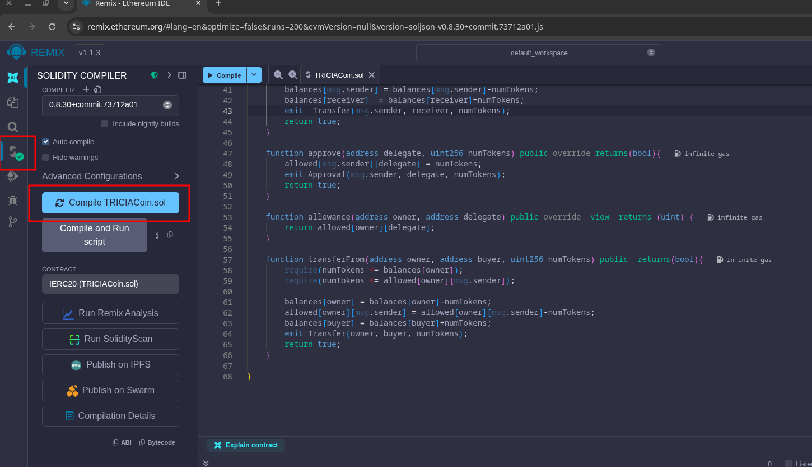

 ### Fazendo Deploy do contrato

 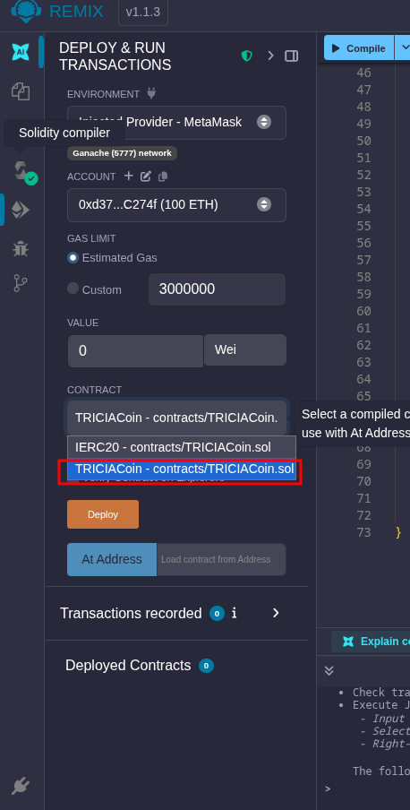


### ao clicar em Deploy, irá direcionar para confirmação de transação no metamask, ao confirmar, valide no Ganash a treansação
 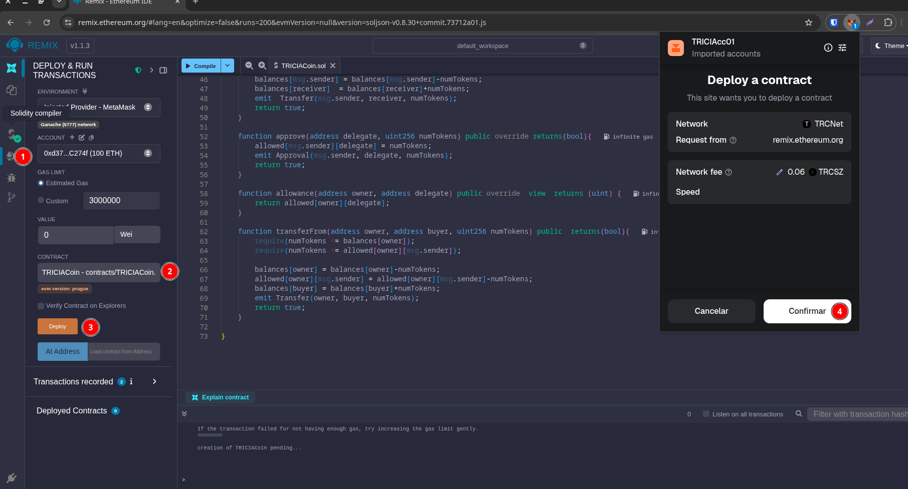

## No ganash, em  BLOCKS E TRANSACTIONS

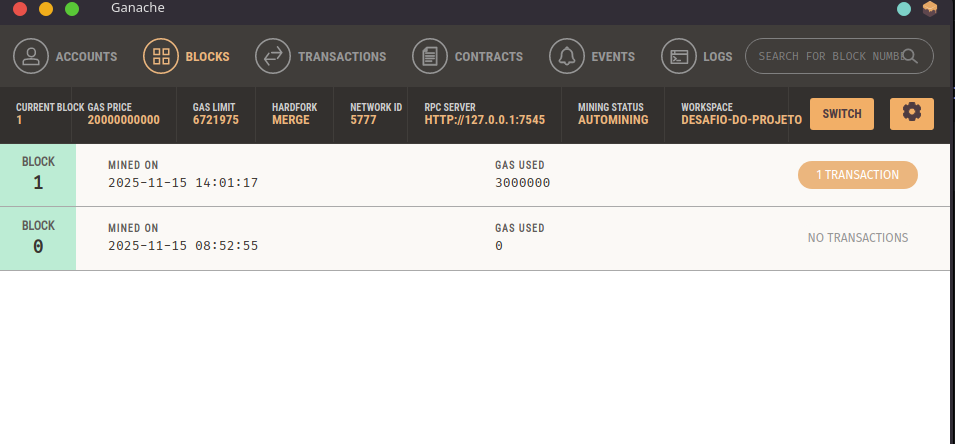

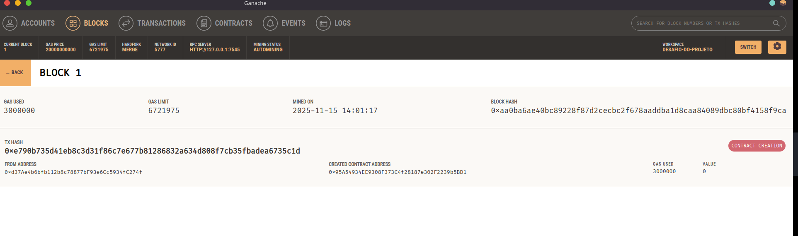


### INTERAGINDO COM O CONTRATO

   - Realize uma nova importação de carteira (privaty key no metamask conforme passos anteriores)
   - Ao importar carteira, faça conexão no remix
  TRansacoes criadas

  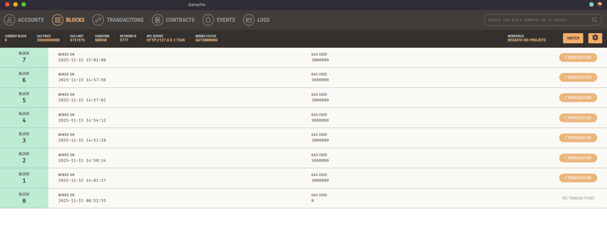

