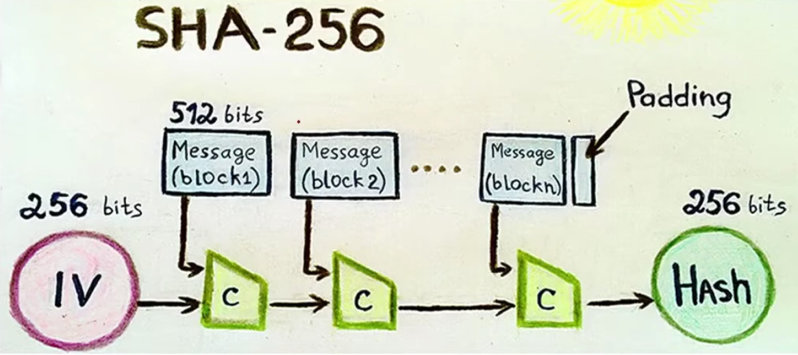
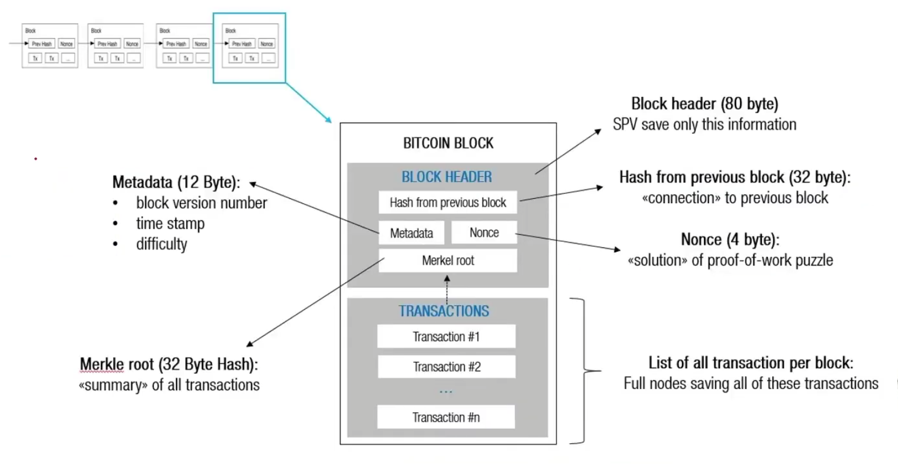

# ✳️ ENTENDENDO SHA 256

### ✳️ INTRIDUÇÃO
  - Nesta etapa vamos explocar um pouco mais do SHA-256m o algoritico reposnsável pela criptografia dos blocos e das carteiras blockchain.
 - Este algoritimo cripotografico foi desenvolvido pelo Agência de Segurança Nacional dos Estados Unidos (NSA) e do Instituito  Nacional de Padrões e Tecnologia (NIST).
  
## ✳️ SHA-256
  O SHA-256, do inglês "Secure Hash Algorithm", é uma função critográfica utilziada como **base do sistema de prova de trabalho do Bitcion**.
 
  O objetivo é gerar **hashes** ou códigos exclusivos com base em padrão com o qual documentos ou dados do comnputador possam ser protegidos contra qualquer agente externo que deseja modifica-los.

  No caso do Biticon, o SHA-256 é usado para o processo de mineração (criação de btc), mas também no processo de geração endereços de btc. Isso de deve ao alto  nivel de segurança que oferece.
## ✳️ COMO FUNCIONA O SHA-256?
  A funçao SHA-256 recebe uma entrada de tamanho aleatórico e a converte em uma saída de tamanho fixo de 256 bits.
  

 - Vamos simular uma convers'ao de alguins dados utilizando o SHA-256.
  
  - Conversor: https://emn178.github.io/online-tools/sha256.html
  
  A função SHA-256 na mineração de Bitcoin se dá quando um **NÓ** se torna elegível a fim de colocar novos blocos dentro da blockchain.
 

## ✳️ PROPRIEDADES DO SHA-256
  **VERSÃO:** número da versão do software Bitcoin

  **HASH DO BLOCO ANTERIOR:** referencia ao shad do bloco anterior

  **RAIZ DE MERCKLE:** um hasg representativo das transações incluídas no bloco.

## ✳️ Como se caracteriza um bloco da blockchain?

### ✳️Metadata (12 Byte):
  - block version numer
  - times stamp
  - dificulty
  
### ✳️ Merkle root (32 Byte Hash):
  ~summary~ of all transcations

### ✳️ Blcok Header (80 byte):
  SPV save only this information

### ✳️ Hash from previous block (32 byte):
  ~connection~ to previous block

### ✳️ Nonce (4 byte):
  ~solutiion~ of proof-of-work puzzle

  ### ✳️List of all transactions per block:
  Full nodes saving all tof these transactions

## ✳️ CONCLUSÃO
  Nesta etapa nós vimos o papel da criptografia no contexto da blockchain e a sua importancia fundamental.