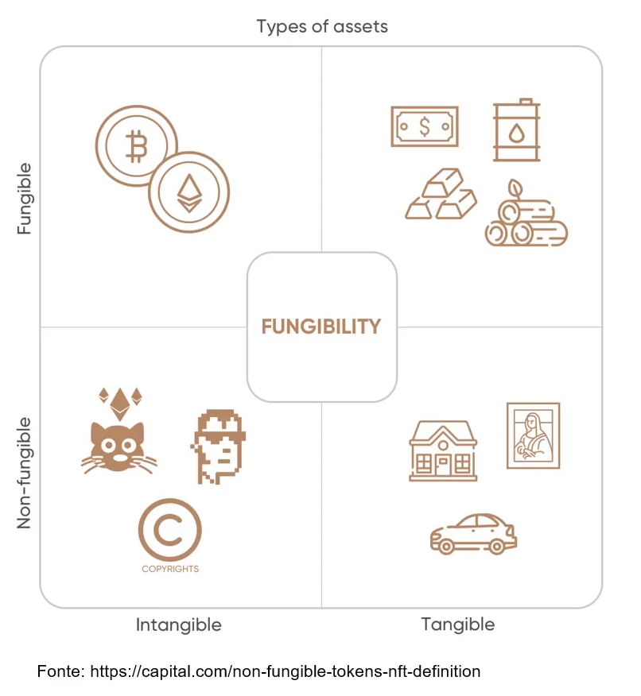

# 💠 VISÃO GERAL DO NFT - Non Fungible Token
  - Por: Ricardo Zavo
  - Avalon Blcokchain (Founder) (empresa que tokeniza comodities)
  - Stonex (CMO)
  ---

## Conceitos NFTs
  🔹Endenter e explorar as possibilidades através dos token não fungíveis. (Não substituiveis)

## Percurso
 🔹 Visão Geral dos NFTs
 🔹 Tipos
 🔹 Ferramentas
 🔹 POAP
 🔹 Cases
 🔹 Onde cromprar, vender
 🔹 Criar um NFT

## 💠 FUNGIBILIDADE
###  💠  Fungivel
  🔹 Fungibilidade é o atributo pertecente aos bens moveis que podem ser substituídos por outro da mesma especies, quantidade e quantidade.

  🔹 O dinheiro é o bem fungivel por exelencia, dado que quando se esmpresta uma quantia a alguem, nao se esta exigindo de volta aquelas mesmas cedulas mas sim o valor correspondente que foi emprestado.

### 💠 Não Fungivel
 🔹  Imagine que uma fabricante de bolsas de luxo faz um unico modelo deuma bolsa. Esse item, por ser unico no mundo, nao pode ser substituido por outros da mesma espcie, logo ele nao é fungivel.

  

   🔹 Tokens Não Fungiveis sao ativos criptograficos em uma blockchain com codigos de identificação exclusivos e metadados que os distiguem uns dos outros.

   🔹 Ao contrário das cryptos, toknes fungiveis (que sao identicos entre si), NFTs nao podem ser negociados ou trocados na mesma equivalencia

### 💠 Como começou
 🔹 Cryptokitties (2017) são representações digitais de gatos com identificação única na blockchain da Ethereum. Cada gatinho é unico e tem preço em eter. Eles reproduzem entre si e produzem novos decentes, que possuem atributos e valorizações diferentes em relação aos seus pais.

### Quando se tornou hype...
  🔹Beeple fatura 69 milhoes vendendo arte digital como NFT.
  Obra de arte digital é registrada como NFT e vendida 69 milhoes token se torna o mais caro da história.

  🔹Os NFTs podem representar diversas propriedade, como itens exclusivos digitais. É necessário que esse item tenham valor e que seja possivel provar apropriedade.

  🔹 Exemplo: Arte digital, cards, colecionaveis, musica, objeto raros, itens de jogos, imóveis. etc.

  🔹 É parecido à escritura de uma casa, no entanto, o NFT seria a escritura não imovel em si.

  🔹 É possivel tokenizar ativos do mundo real, como propriedade, documentação, licenças ; historico medicos, certições de nascimento e obto.No entando, os desenvolvimentos nesta categoria ainda estao em um estagio inicial e seus casos de uso sao relativamente raos.

  🔹 Mas a medida que os NFTs continuam a se desenvolver e expandir, quem pode dizer que um dia (talvez em breve) voce nao será capaz de possuir um lote de terreno em outro pais a milhares de km de distancia em sua carteira.