# 💠 CRIANDO NFT

### # 💠 Entendendo o Desafio
 🔹Descrição do Desafio
  Neste Desafio você irá criar um Token Não Fungível, o famoso NFT, na Blockchain gratuita OpenSea Polygon. Lembre-se de seguir todas as instruções e o passo a passo fornecidos pelo Instrutor.
 

🔹 Links úteis
Carteira do NFT.txt
 

# 💠 Orientações Para a Entrega
  Para entregar o seu projeto, você terá que criar um reposítório público no GitHub.

  1. Criar um novo repositório (sempre público) através do link https://github.com/new (acessível pelo site através do botão "+", depois "Novo repositório"). 

  2. Neste repositório, insira todos os arquivos relevantes para seu projeto. No caso, sugerimos que você crie um README contendo links úteis e imagens que evidenciem o sucesso da sua criação.

  3. Não deixe de enviar o seu NFT para a Carteira que o Instrutor disponibilizou:

  OpenSea – Polygon ​(Spoiler, nao ser ve de nada em 2025)
 >  0xA9155F5B6FC993A82346a8ff86EFEf513fc4c096​

  Uptick​ ​(Spoiler, nao ser ve de nada em 2025)
 > iaa1ld2ck02x0909lg5tkqwdkfnsnsz7mmg6952jar 
 

#####  💠 IMPORTANTE: Os Labs entregues na plataforma da DIO ficam disponíveis para as empressas parceiras avaliá-los tecnicamente. Por isso, caprichem no desenvolvimento e documentação de suas soluções, pois elas podem ser um grande diferencial ao seu favor em um processo de contratação 😎

Bons estudos 😉

 
 ## Iremos iniciar acessando o site OpenSea e conectando nossa carteira do Meta
  - https://opensea.io/profile
  
  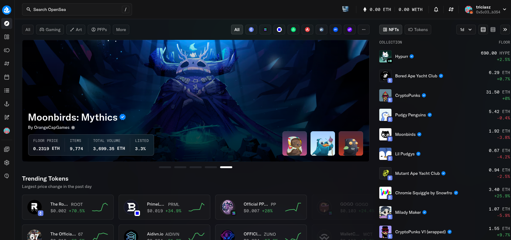

  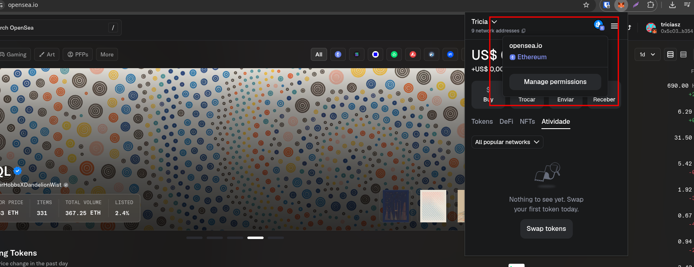
  
  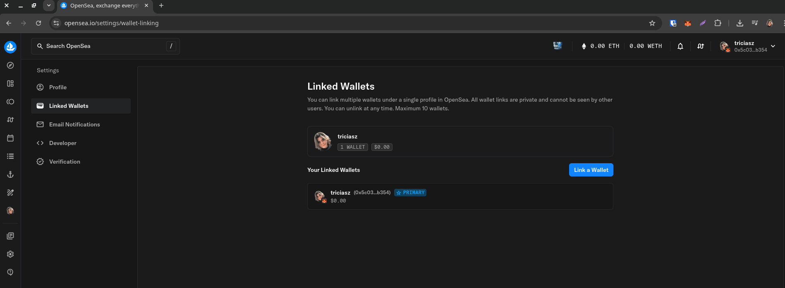
# Com atualização da plataforma, voce conseguirá criar um NFT pelo menu "Studio Collections > Create"

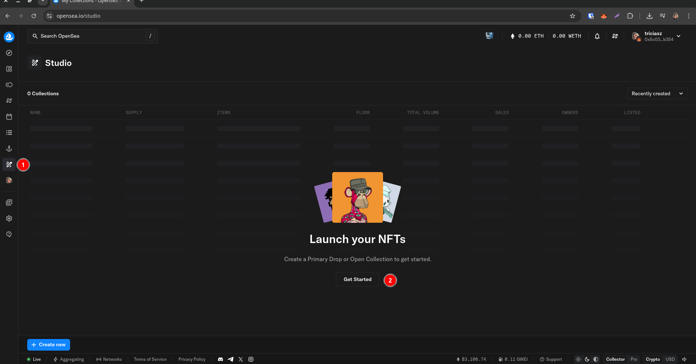

## Vai te mostrar duas opções, nao sei se ta certo, mas foi o mais proximo que cheguei com a opção "CRIAR"

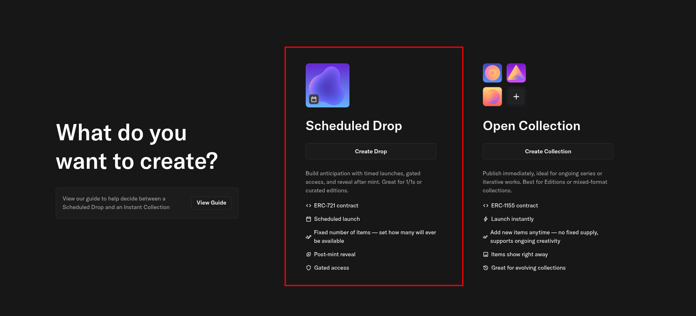

## Ou indo em seu perfil, vai mostrar que voce ainda nao tem artes (se for conta nova)

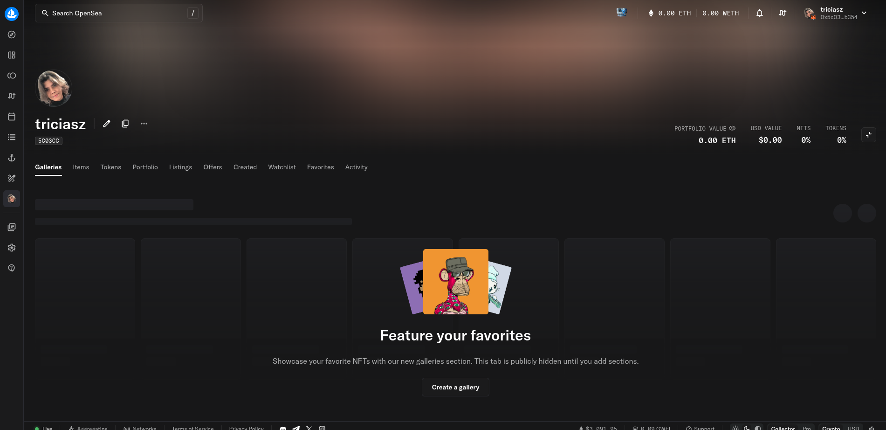

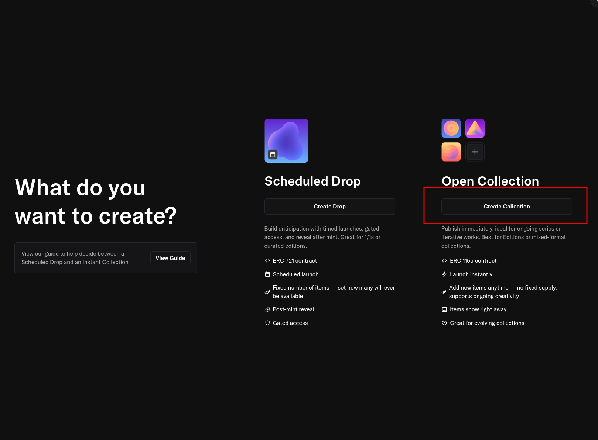

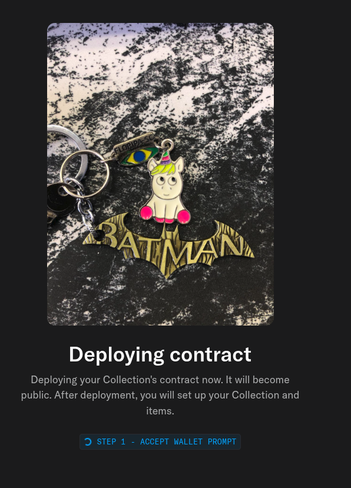

## Nao ta dando muito certo rs claro que é porque nao tenho cryptos, tentei utilizar uma rede simuladas, mas nao foi. 

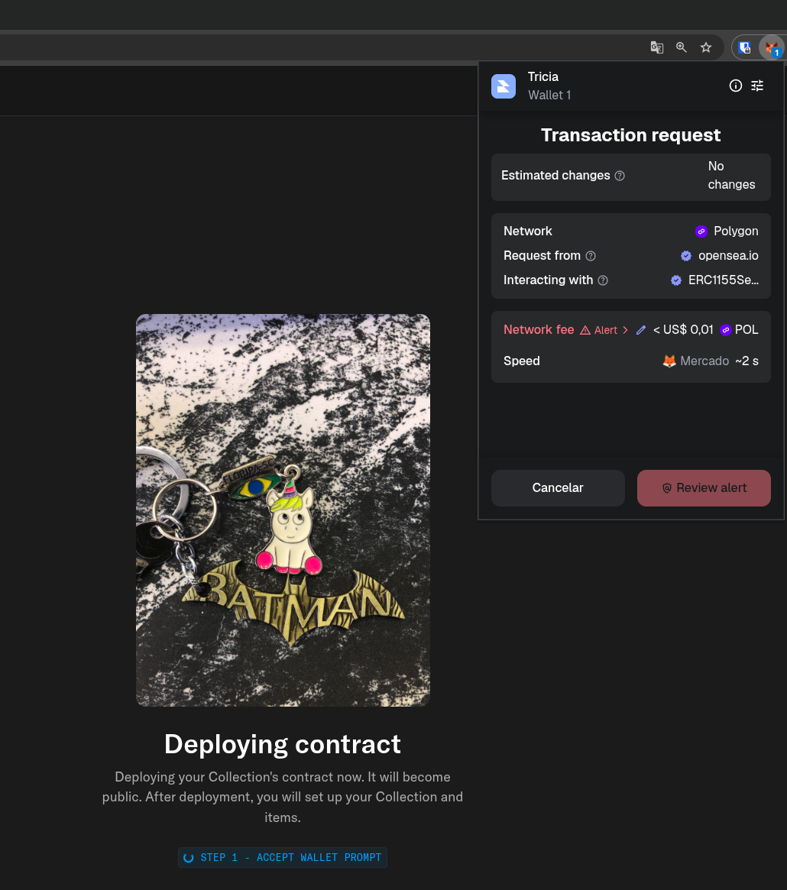

## Feita também a tentativa do DROP, mas também requer valor em carteira para publicação.

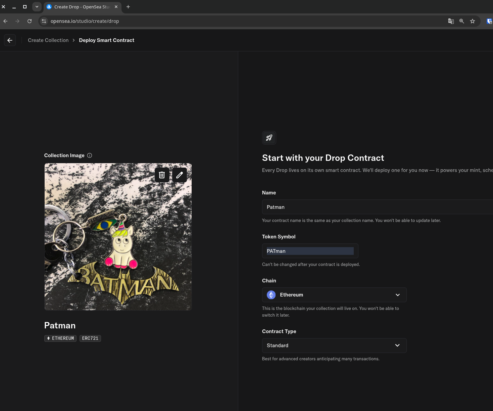

## No fim, meio frustradas tentativas de publicação no SEA. V amos tentar na Uptik

### Na Uptik foi mais facil, de encontrar o create, ao acessar collections.

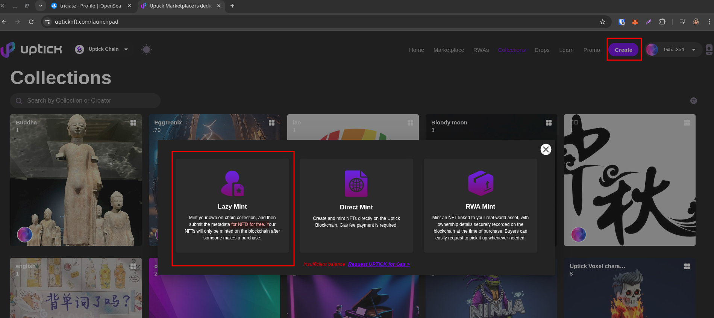

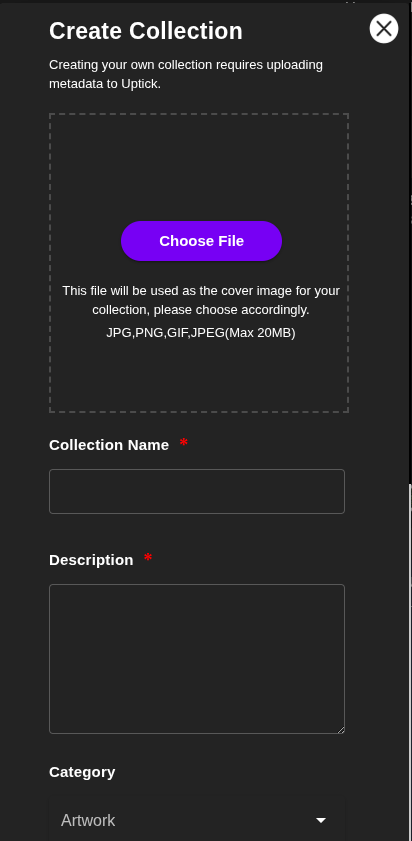

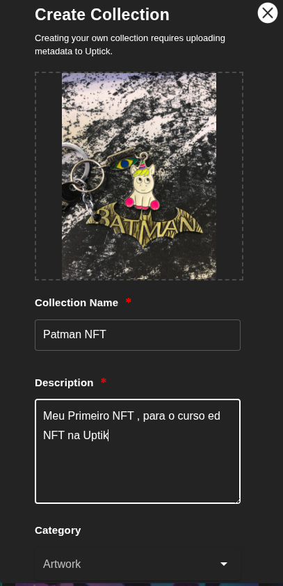

# Sem gás =( e a carteira disponibilizada pelo instrutor, não está mais disponivel.
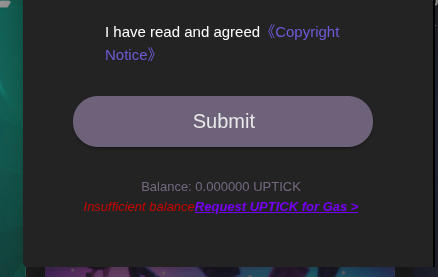

OSB: Buscar novas infos de como criar NFTS de maneiras alternativas. 