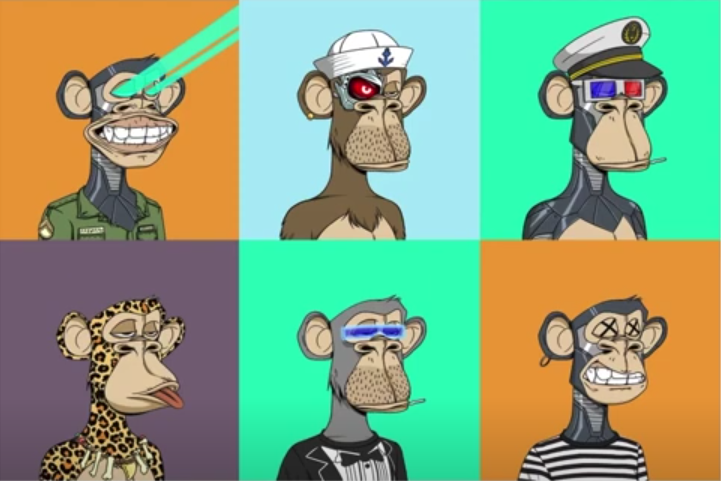
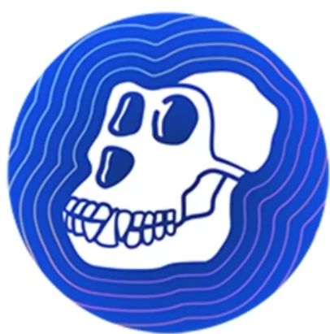
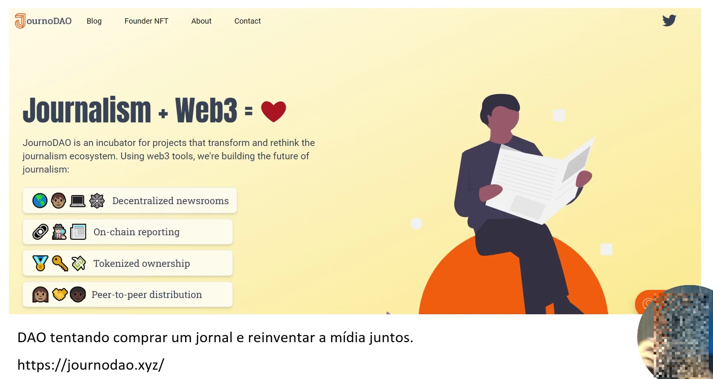

#  💠 CASES DAOS
  - Por: Ricardo Zavo
  - Avalon Blcokchain (Founder) (empresa que tokeniza comodities)
  - Stonex (CMO)
  ---

## 💠  Bored Ape Yatch Club
  
  

  🔹Token de governança

## 💠 Descentralnd DAO
  🔹Palataforma de metaverso gerenciada por seus membros da DAO

## 💠 Krause House DAO
  🔹Os membros podem votar nas atividade dos DAOS e ajudar a criar estrategias para comprar uma equipe (basquete etc)

## 💠 JournoDAO
  

## 💠 CityDAO
- Site: [citydao.oi](https://citizen.citydao.io/)
