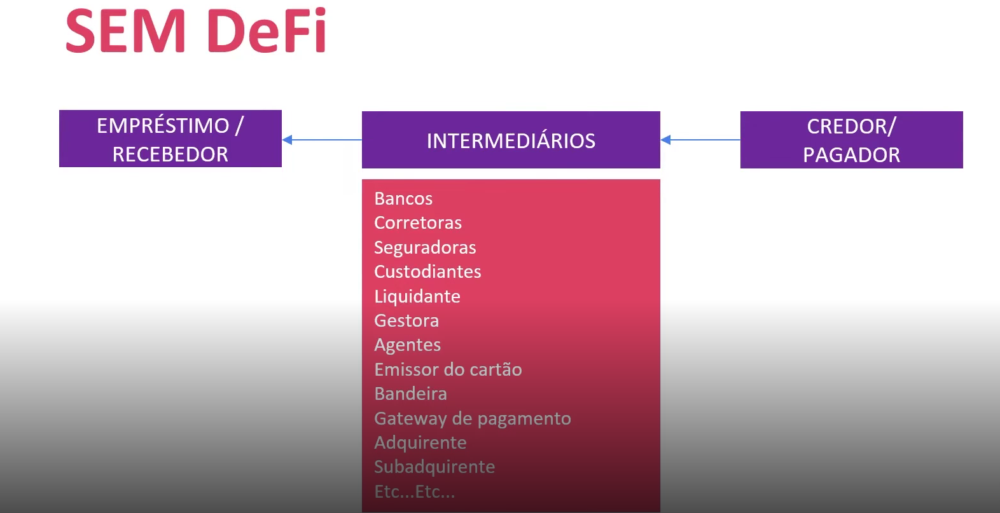
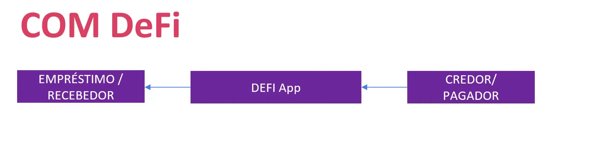

#  💠 VISÃO GERAL DE DeFi
  - Por: Ricardo Zavo
  - Avalon Blcokchain (Founder) (empresa que tokeniza comodities)
  - Stonex (CMO)
  ---
# ⚠️ ATENÇÃO, ESTE MODULO NÃO SE TRATA DE RECOMENDAÇÕES FINANCEIRAS.

## 💠  Percurso
  🔹Visão geral

  🔹 Aplicações DeFi (parte I)

  🔹 Aplicações DeFi (parte II)

  🔹Pools de Liquidez
  
  🔹APR/APY

  🔹Yield Farming, Liquididy Minig, Staking

  🔹Projetos Populares e Ferramentas

  🔹GameFi, ReFi, DeSci, DeSo, Descentralized Indentity

# 💠 Introduçao
  > O proposito das DeFi é criar um sistema financeiro descentralizado que oferece os mesmos produtos e serviços financeiros tradicionais sem a necessidade de autoridades centrais.

# 💠 Objetivo
  - Eliminar as taxas que os bancos e outras empresas financeiras cobram pelo uso do serviço.
  - Reduzir i tempo de transação
  - Facil acesso a serviços financeiros, especialmente para aqueles que estao isolados do sistema financeiro atual.
  
# 💠 Finanças Centralizadas
  🔹Nas finanças centralizadas, o dinheiro é retido por bancos e terceitos que facilitam a movimentação do dinheiro entre as partes, cobrando cada taxa pelo uso dos seus serviços

# 💠 Finanças Descentralizadas
  🔹Nas finanças descentralizadas eliminam intermediarios ao permitir que pessoas, comerciantes e empresas realizem transaçoes financeiras por meio da tecnologia Blockchain.

  
  

 🔹 Os users matem o controle total sobre seus ativos e interagem com por meio de aplicações descentralizadas (dApps) e de forma peer-to-peer (P2P). Basta ter conexao com internet.
> dApps ==> P2P ==> Interoperaveis

# 💠 Por outro lado...
  As aplicações DeFi são complexas e não sao faceis de entender.
  Alto nivel de volatidade alem de alto risco de fraudes e golpes.

# 💠 Conclusão
  🔹 As finanças descentralizadas estão em constante evolução.

  🔹 A tecnologia elimina a necessidade de um modelo finaceiro centralizado, permitindo qualquer pessoa usar os serviços financeiros em qualquer lugar, independentemente de quem ou onde estiver.

  🔹Ainda não é regulamentado e esse ponto é bem complexo pois cada país tem suas "regras" financeiras. A infraestrutura ainda é precária, hacks, golpes, ou se ja, como toda tecnologia emergente.

