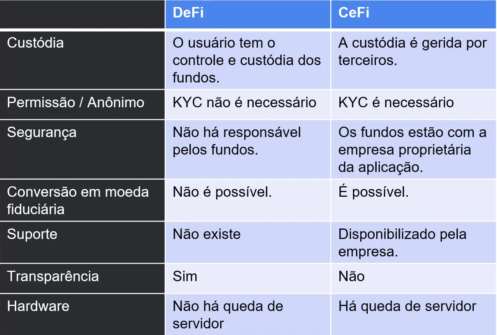
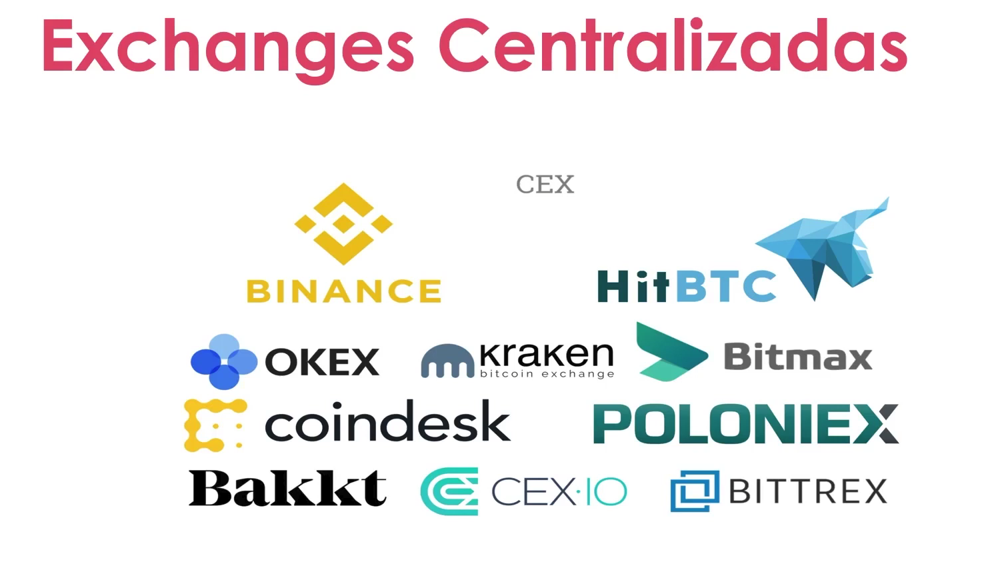
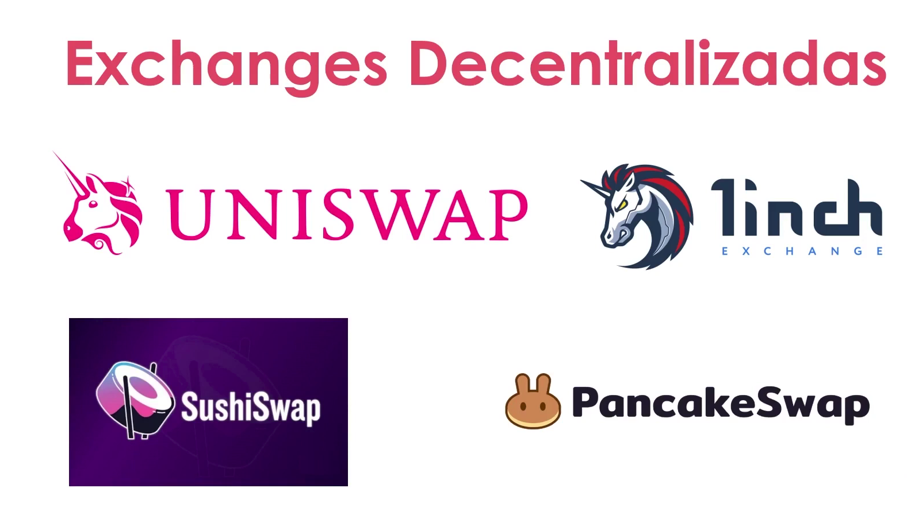

#  💠 APLICAÇÕES DeFi - Parte II
   - Exchanges
   - CeFi
   - Defi
  
## 💠  Introdução
  ### 💠  Exchanges
  🔹Exchanges - funcionam de maniera semelhante às plataformas de corretagem onlise, fornecendo as ferramentas necessárias para comprar e vender cryptos e tokens.

  🔹CeFi - Centralized Finance

  🔹Defi - Descentralized Finance

  ## Defi vs CeFi
    

## 💠  CeFi - Centralized Finance
    

## 💠  Defi - Descentralized Finance
    

# 💠 Conclusão
  🔹 Qual a melhor? Sem resposta
  Ambas tem seus riscos