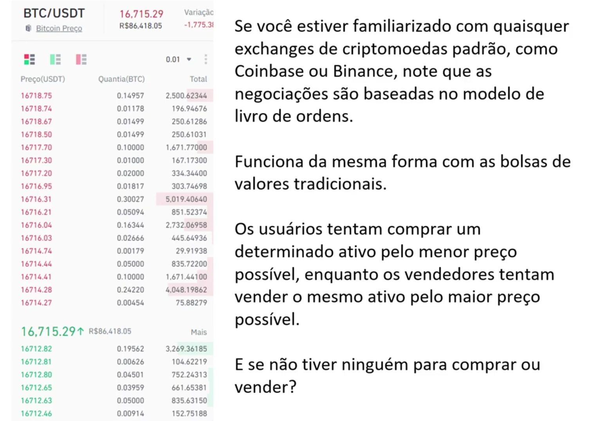
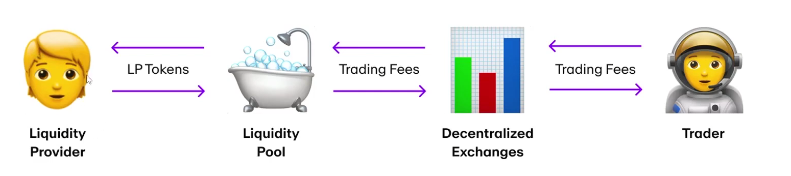

#  💠 POOLS DE LIQUIDEZ
  - Por: Ricardo Zavo
  - Avalon Blcokchain (Founder) (empresa que tokeniza comodities)
  - Stonex (CMO)
  ---

## 💠  Introdução
  🔹Os pools de liquidez, sao "piscinas" de tokens bloqueados em um contrato inteligente. Eles sao usados para facilitar a negociação, fornecendo liquidez e sao amplamente utilizados por algumas exchanges descentralizadas, também conhecidas como DEX.

  

 ### OBS: Sem os formadores de mercado, uma exchange ou bolsa se tona instantaneamente oliuida e é praticamente inutilizavel

 ### Dá para fazer isso de forma automatica? Sim, se chama Pool de Liquidez

  🔹 Em sua forma basica, um unico pool de liquidez contem 2 tokens e a cada pool cria um novo mercado para esse par especifico de tokens.

  Exemplo: ETH / USDT
  - O provedor de liquidez é incetivado a forncer um valor igual de ambos os tokens ao pool.
  
  # 💠 Como funciona?
  🔹 Quando a liquidez é forncecida a um pool, o provedor de liquidez (PL) recebe tokens especiais chamados tokens LP em proporção à quantidade de liquidez fornecida ao pool.

  🔹 Quando uma negociação é facilitada pelo pool, uma taxa de 0,3% é distribuida proporcionalmente entre todos os dententores de tokens LP.

  Cada troca de token que um pool de liquidez facilita, resulta em um ajuste de preço de acordo com um algoritimo de determinação de preços. Esse mecanismo também é chamado de criador de mercado automatizado (AMM)

# 💠 How Liquidity Pools Work
  

  Devido a isso, as equipes sao **massivamente incetivadas a recompensar aqueles que fornecem liquidez**, tristribuido posteriormente taxas de negociacao em recompensa por sua contribuicao.

  # 💠 Conclusão
  Cuidado!
  Não ignore  riscos em potenciais, como bugs de contrato inteligente, chaces de admin e risco sistemicos, hacks de pool de liquidez etc.
  