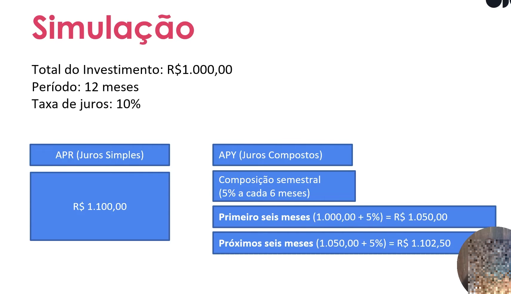

#  💠 APR e APY

## 💠  Introdução
  🔹APR - Annual Percetage Rate - Taxa Percetual Anual
  - Juros Simples - No final do preiodo, voce recebe o percentual pré-fixado inicialmente.

  🔹APY - Annual Percetage Yield - Rendimento  Percetual Anual
  - Juros Compostos - NOs lucros vao sendo reinvestidos ao longo do periodo.
  
  